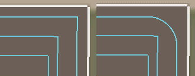

# Generátor tras souvratí

  
Nastavení souvrati se zobrazí pouze tehdy, když nastavíte alespoň 1 v poli 'Počet souvratí'.  
Získáte možnosti, kde začít, nastavení rohů, směr a překrytí.  
Velmi se doporučují souvratě, aby se zabránilo tomu, že nástroje opustí pole při otáčení.  

  
- Začátek práce: Jak je uvedeno v rozšířené nabídce AI, poloha pole se používá k nastavení počáteční nebo koncové polohy pro trasu práce na poli.  
Když je nastaven start na souvrati, říká, kde by měl být start. Když se změní na začátek na řádcích, řekne, kde má práci ukončit.  
- Souvraťové rohy: Zaoblený bude mít jednoduché vyhlazení přes rohy. To funguje pro všechny nástroje, ale povede to k drobným neopracovaným místům v rozích.  
S pocouvnutím se dají zmenšit, ale nikdy nezmizí. Pocouvnutí vygeneruje otočení na základě úhlu hranice pole.  
Zaoblený vezme v úvahu aktuálně vybraný poloměr zatáčky, aby byl pro daný nástroj nejlepší zaoblený roh.  
- Směr souvrati: ve směru nebo proti směru hodinových ručiček. To může být důležité pro kombajny a sklízeče, v závislosti na tom, na které straně je výsypová roura nebo dopravní pás.  
- Souvraťový přesah: Kolik % by měly mít všechny souvratě. První se nebude překrývat s hranicí pole, ale vnitřní se budou překrývat se svou sousední.  

