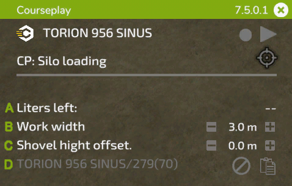

# Mini HUD

## Obecné

  
A: Podržením levého tlačítka myši na titulku přetáhněte HUD do požadované polohy. Na pravé straně se zobrazí nainstalovaná verze a kliknutím myši se HUD zavře křížkem.  
B: Kliknutím na ikonu Courseplay získáte přístup k obecným nastavením.  
C: V této poloze se zobrazí název vozidla. Kliknutím na něj se dostanete do nabídky nastavení vozidla.  
D: Tyto symboly slouží k: (1) odstranit aktuálně načtenou trasu, (2a) přepnout způsob zobrazení trasy, (2b) pokud není načtena žádná trasa, zobrazí se tlačítko pro záznam trasy na hranici pole, (3) spustit nebo zastavit pomocníka.  
E: Tato ikona cíle má různé možnosti v závislosti na zvoleném režimu, otevírá nabídku AI s úlohou a umožňuje umístit značku a další nastavení úlohy. Na levé straně ikony se při spuštěné terénní práci zobrazuje zbývající čas trasy.  
F: Kliknutím na text přepnete dostupné režimy pro aktuální nástroje.  
G: Nastavení zobrazená pod tímto řádkem závisí na aktuální úloze. Budou vysvětlena na následujících obrázcích.  

## Polní práce

  
A: Klepnutím na tlačítko vyberte místo, kde má být práce zahájena. Pokud je načtena trasa s více nástroji, můžete na pravé straně vybrat jízdní pruh.  
B: Zobrazí název načtené trasy. Pokud jste trasu právě vygenerovali, zobrazí se Dočasná trasa. Na pravé straně se po spuštění úlohy zobrazí aktuální/celkové body trasy.  
C: Kliknutím na text se přepočítá pracovní šířka, nebo ji můžete nastavit ručně vpravo kliknutím na +/- nebo kolečkem myši nad číslem.  
D: Některé nástroje potřebují odsazení do strany. Courseplay jej vypočítá automaticky při kliknutí na text nebo jej můžete změnit ručně stejně jako pracovní šířku.  
E: Symbol na pravé straně slouží ke zkopírování aktuální trasy do schránky. Název zkopírované trasy se pak zobrazí vlevo. Zkopírovanou trasu můžete načíst do jiného vozidla, které zatím žádnou trasu nemá. Chcete-li trasu ze schránky odstranit, klikněte na symbol pro odstranění.  

## Vykládka kombajnu

  
A: Vyberte, jaký typ vozidla má pracovník vyložit. To je užitečné, pokud na stejném poli pracují různé typy, například kombajn a nakladač, jako je ROPA Maus.  
B: Nastavte úroveň naplnění (40 % - 100 %), při které má pracovník dojet na místo vykládky. Pro změnu klikněte na +/- nebo použijte rolovací kolečko nad číslem.  
C: Někdy není poloha odvozce pod rourou ideální. To může být způsobeno přívěsem nebo rourou sklízecí mlátičky, někdy je to způsobeno sklonem pole. Zde můžete vzdálenost ke kombajnu ručně korigovat.  
D: Stejné jako výše, ale zde můžete nastavit polohu vykládacího zařízení vzhledem k rouře dopředu nebo dozadu.  
E: Podobně jako při kopírování trasy můžete i zde zkopírovat načtenou trasu do jiného vozidla.  

## Sběr/ovíjení balíků

  
A: Zbývající balíky na poli.  
B: Typ balíků ke sběru/ovíjení.  
C: Posun mezi osou traktoru a osou ramene nakladače. U větších traktorů (např. se širšími pneumatikami) může být nutné tento parametr upravit.  

## Plnění silážní jámy

  
A: Zbývající objem hromady v litrech.  
B: Pracovní šířka, stejná jako u práce v terénu.  
C: Pro Courseplay je třeba správně nastavit přesnou výšku lžíce nad zemí. Protože tato výška může být pro každý nástroj jiná, můžete ji zkontrolovat a upravit pomocí tohoto nastavení.  
D: Stejně jako u vykládacího zařízení můžete i zde zkopírovat načtenou trasu do jiného vozidla.  

## Práce v silážní jámě

  
A: Podobně jako u Plnění silážní jámy je rozhodující výška nahrnovače. Zde ji můžete nastavit.  
B: Zobrazuje průběh zhutňování. Kliknutím na něj se přepne možnost zastavení pracovníka po dosažení úplného zhutnění.  
C: Zde můžete v případě potřeby změnit pracovní šířku.  
D: Toto nastavení říká pracovníkovi, že má čekat v sile nebo na zvoleném parkovacím místě, když se k silu blíží vykladač.  

