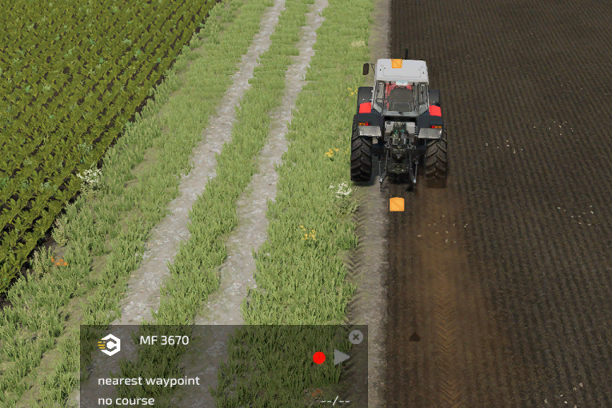

# Vlastní pole

  
Vlastní pole lze vytvořit dvěma způsoby.  
Prvním z nich je použití funkce záznamu HUD.  
Spusťte záznam a zaznamenejte hranici pole.  
Po dokončení znovu stiskněte tlačítko a budete dotázáni, zda jej chcete uložit.  

  
Když se podíváte na nabídku AI, uvidíte hranici zaznamenaného pole.  
Kliknutím na Název získáte možnost jej buď smazat, nebo přejmenovat.  

  
Druhou možností je nakreslit vlastní pole na mapu v nabídce CP AI.  
Chcete-li spustit kreslení, stiskněte tlačítko v levém dolním rohu nebo stiskněte odpovídající klávesu.  
Poté se v horní části obrazovky zobrazí text.  
Začněte kliknutím pravým tlačítkem myši pro nastavení počáteční pozice.  
Podržením klávesy Shift se čára narovná v úhlech 90°.  
Další kliknutí vytvoří čáry k předchozímu kliknutí.  
Jakmile nakreslíte druhou čáru, pole se automaticky uzavře. Stále můžete nakreslit další čáry, abyste pole ještě více vymezili.  
Poslední linii nemusíte kreslit až na začátek, protože se automaticky vygeneruje přímo na začátek.  

