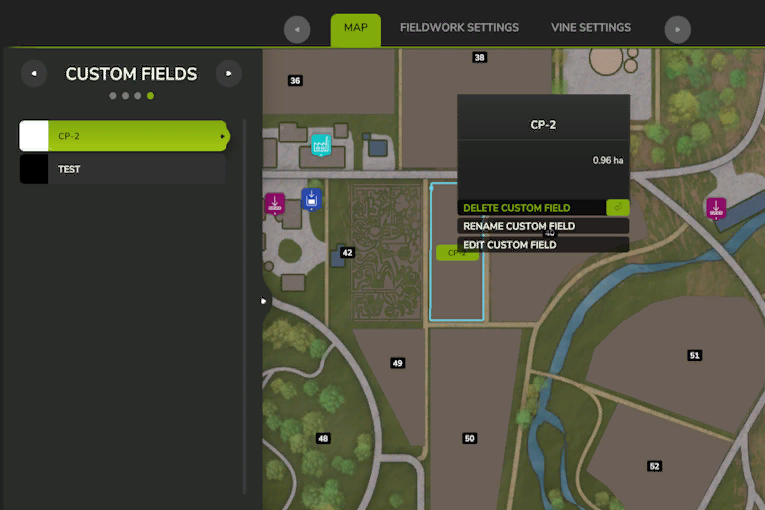

# Brugerdefineret marker

  
Du kan oprette brugerdefineret mark på to måder.  
Den første er ved at benytte markoptegnelse i HUD.  
Start markoptegnelse ved at trykke på record knappen.  
når du er færdig tryk igen på record knappen, du bliver herefter spurgt om du vil gemme denne.  

  
Den optegnede mark i AI hjælper menu.  
Hvis du klikker på navnet til marken, for du nu mulighed for at omdøbe den eller slette den.  

  
The second option is to draw the custom field on the map of the CP AI menu.  
To start the drawing, hit they button on the bottom left corner or hit corresponding key.  
After that a text appears on the top of your screen.  
Start by clicking the right mouse button for setting the start position.  
By holding the shift key, the line will be set straight in 90° angles.  
The next clicks will create lines to the previous click.  
Once you draw a second line, the course will be automatically closed. You can still draw more lines to define the field even further.  
You don't need to draw the last line to the start, as it gets generated automatically straight to the start.  

