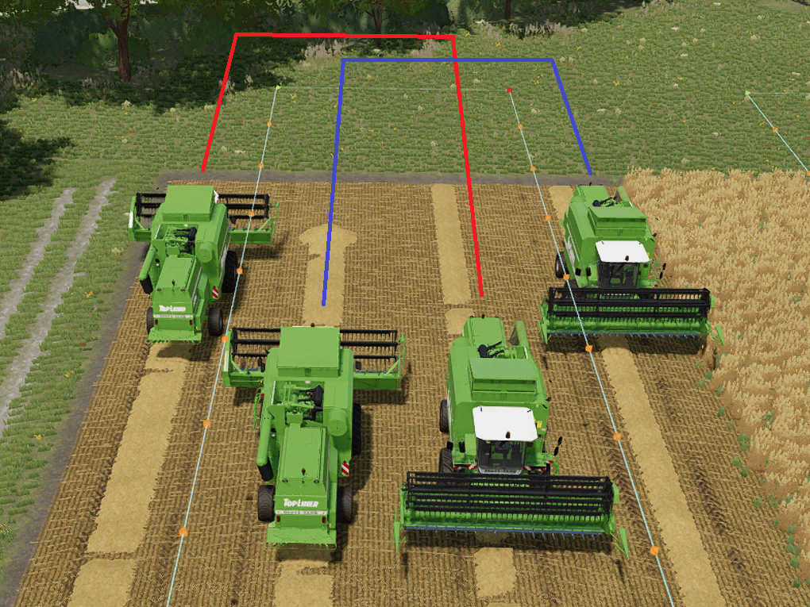

# Symetrisk vognbaneskift

  
Symmetrisk vognbaneskift bruges i konvojtilstand og fortæller chaufføren, i hvilken vognbane han skal køre efter svinget.  
Dette er lidt svært at forstå, så lad os tage et kig på to eksempler.

  
Når det symmetriske vognbaneskift er slået fra, forbliver køretøjet på dets forskudte vognbane.  
Det betyder, at han altid kører til venstre eller højre fra banen.  
Dette sikrer, at hjælperne ikke kører ved siden af ​​hinanden.  
Der vil ikke være risiko for konflikt med en anden chauffør.  

  
Hvis symmetrisk vognbaneskift er slået til, vil venstre og højre blive udskiftet (men ikke vist i HUD).  
Køretøjer kan komme i konflikt med hinanden, når de kører mod hinanden.  
Hvad er fordelen ved symmetrisk langeskift så?  
Hvis du ser på rækkefølgen af ​​banerne, fra venstre mod højre, vil det være tydeligt:  
Uden symetrisk ændring: venstre, højre, venstre, højre - det er næsten som at springe en bane over.  
Med symetrisk ændring: venstre, højre, højre, venstre - fra venstre mod højre, den ene bane efter den anden.  
I eksemplet med en mejetærsker betyder det, at ingen mejetærsker vil have afgrøder til venstre og højre for sin bane.

