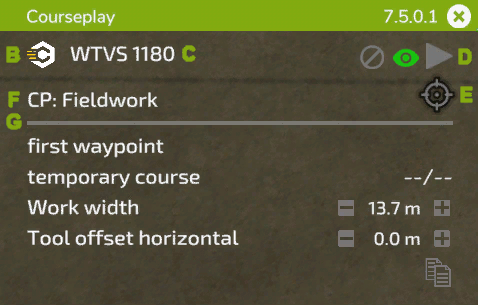

# Mini HUD

## General

  
A: Mantenga presionado el botón izquierdo del mouse sobre el título para arrastrar el HUD a la posición que desee.  En el lado derecho se muestra la versión instalada y la X cerrará el HUD con un clic del mouse.  
B: Haga clic en el icono de Courseplay para acceder a la configuración global.  
C: En esta posición se muestra el nombre de su vehículo.  Al hacer clic en él, accederá al menú de configuración del vehículo..  
D: Estos símbolos son para: (1) eliminar el curso actualmente cargado, (2a) alternar cómo se mostrará el curso, (2b) si no hay ningún curso cargado, se muestra un botón de registro para registrar un curso en el borde del campo, (3) para iniciar o detener el ayudante.  
E: Este ícono de objetivo tiene diferentes opciones dependiendo del modo seleccionado, abre el Menú AI con el trabajo y puede colocar marcadores y configuraciones adicionales para el trabajo.  En el lado izquierdo del ícono, con un trabajo de campo en ejecución, se muestra el tiempo restante del curso.  
F: Haga clic en el texto para alternar los modos disponibles para sus herramientas actuales.  
G: Las configuraciones que se muestran debajo de esta línea dependen del trabajo actual.  Estos se explicarán con las siguientes imágenes.  

## Trabajo de campo

  
A: Haga clic para seleccionar dónde comenzar el trabajo.  Si se carga un recorrido multiherramienta, en el lado derecho puede seleccionar el carril.  
B: Muestra el nombre del curso cargado.  Si acaba de generar un curso, muestra 'curso temporal'.  En el lado derecho verá los puntos de ruta actuales/totales una vez que se inicie el trabajo.  
C: Al hacer clic en el texto se volverá a calcular el ancho de trabajo, o puede configurarlo manualmente a la derecha haciendo clic en +/-, o con la rueda del mouse sobre el número.  
D: Algunas herramientas necesitan un desplazamiento lateral.  Courseplay lo calculará automáticamente al hacer clic en el texto, o puedes cambiarlo manualmente al igual que el ancho de trabajo.  
E: Utilice el símbolo del lado derecho para copiar el curso actual al portapapeles.  El nombre del curso copiado se muestra a la izquierda.  Puede cargar el curso copiado en otro vehículo que aún no tiene.  Para eliminar el curso del portapapeles, haga clic en el símbolo de eliminación.  

## Descargador de combinada

  
A: Seleccione qué tipo de vehículo debe descargar el trabajador.  Esto resulta útil si trabaja en el mismo campo diferentes tipos, como por ejemplo una cosechadora y un cargador como ROPA Maus.  
B: Establezca el nivel de llenado (40% - 100%) que el trabajador debe conducir hasta el sitio de descarga.  Haga clic en +/- o use la rueda de desplazamiento sobre el número para cambiar.  
C: A veces, la posición del descargador debajo de la tubería no es perfecta.  Esto puede deberse al remolque o a la tubería de la cosechadora, en ocasiones provocado por la pendiente del campo.  Puede corregir manualmente la distancia a la cosechadora aquí.  
D: Igual que arriba, pero aquí puede ajustar la posición del descargador con respecto al tubo hacia adelante o hacia atrás.  
E: De manera similar a copiar un recorrido, aquí puede copiar las posiciones de los marcadores a otro vehículo.  

## Recoger/Envolver pacas

  
A: Pacas restantes en el campo.  
B: Tipo de Pacas a recoger/envolver.  
C: Desplazamiento entre la línea central del tractor y la línea central del brazo del cargador.  Es posible que necesite ajustar esto para tractores más grandes (por ejemplo, con neumáticos más anchos).  

## Cargador de silos

  
A: Tamaño restante del montón en litros.  
B: Ancho de trabajo, igual que en el trabajo de campo.  
C: Courseplay necesita que la altura exacta del cucharón sobre el suelo esté configurada correctamente.  Dado que esta altura puede ser diferente para cada herramienta, puede verificarla y ajustarla con esta configuración.  
D: Al igual que con el descargador, puedes copiar las posiciones de los marcadores a otro vehículo.  

## Trabajador de silo

  
A: Al igual que con el cargador de silo, la altura del nivelador es fundamental.  Puedes ajustarlo aquí.  
B: Muestra el progreso de la compactación.  Al hacer clic en él, se alterna la opción para detener el controlador cuando se alcanza la compactación completa.  
C: Puede cambiar el ancho de trabajo cuando sea necesario aquí.  
D: Esta configuración le indica al trabajador que espere en el silo o en una posición de estacionamiento seleccionada cuando un descargador se acerca al silo.  

