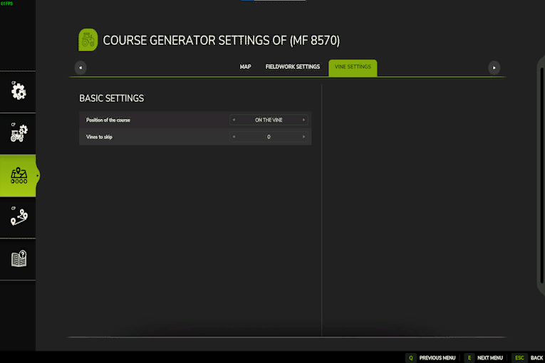
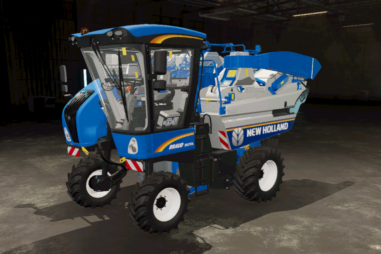
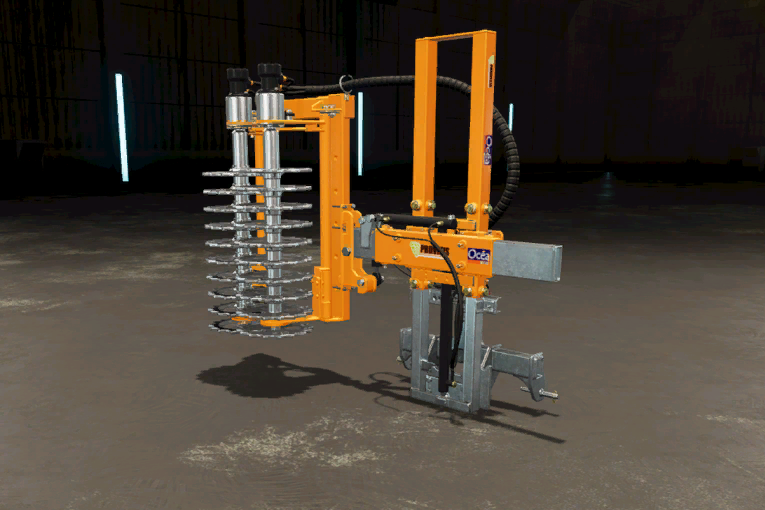
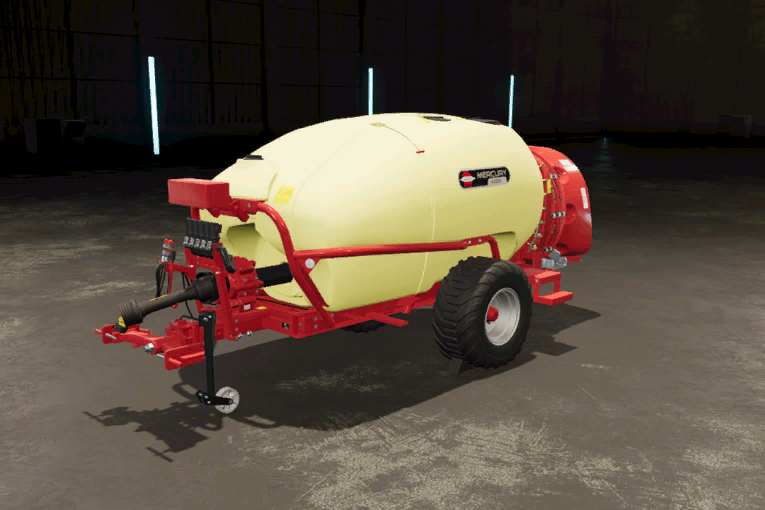

# Trabajo en Vides

  
Trabajar en vides es un poco más complejo que trabajar en un campo normal.  
Para obtener el mejor resultado, las enredaderas deben estar una al lado de la otra dentro de la cuadrícula predeterminada.  
El final y el comienzo de cada vid también deben tener aproximadamente la misma longitud.  
Si las vides están en un campo existente, puede abrir el generador de forma directa como de costumbre.  
Si no están en un campo, debe ir al menú AI y colocar el marcador de campo en las vides.  

  
El generador para vides tiene menos opciones.  
Dependiendo de la herramienta, debe elegir trabajar en las vides o al lado de las vides.  
P.ej. el cosechador predeterminado necesita conducir y trabajar en la vid.  
      La prepodadora debe conducir a la izquierda de las vides, pero trabaja en la vid, por lo que debe optar por trabajar en la vid, pero conducir con una compensación.  
      Los rociadores deben conducir al lado de las vides y deben saltarse una fila, ya que rocía hacia la izquierda y hacia la derecha.  

  
Se debe generar un curso de vid sobre las vides, ya que se llegó a conducir y trabajar en las vides.  

  
La prepodadora trabaja en las vides, por lo que el curso debe generarse en las vides.  
Las herramientas vienen con una compensación para el tractor, por lo que el tractor conduce entre las vides.  

  
El rociador funciona junto a las vides, por lo que debe conducir hacia la izquierda o hacia la derecha de las vides.  
Dado que el rociador puede trabajar en las vides izquierda y derecha al mismo tiempo, podemos saltarnos una fila.  

