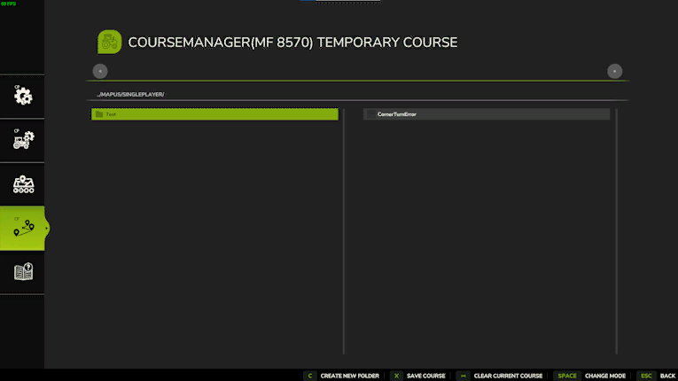
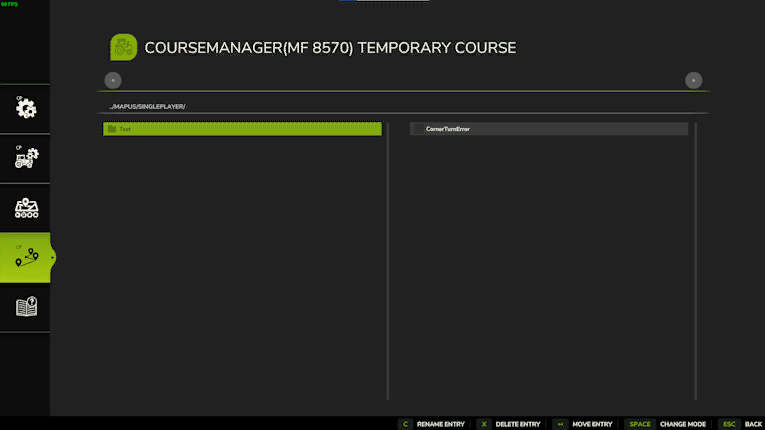

# Gestionnaire des courses

  
Le gestionnaire de courses vous permet de sauvegarder et de charger vos courses pour une utilisation ultérieure.  
La sauvegarde de la course est également obligatoire lorsque vous utilisez les outils multiples afin de pouvoir affecter la même course à plusieurs ouvriers.  
Cela vous permet également de pouvoir affecter la course d'une moissonneuse ou d'une faucheuse à une presse ou un véhicule avec une autochargeuse pour venir récupérer les andains.  
  
L'emplacement des sauvegarde se trouve ici : ..\My Games\FarmingSimulator2022\modSettings\FS22_Courseplay\Courses\Mapname.SampleModMap (ou pour les cartes de base de type MapUS).  
Le gestionnaire fonctionne différement de celui présent dans FS19.  
Les courses sont sauvegardées dans des dossiers affichés sur le côté gauche. Il faudra donc au moins créer un dossier pour commencer à sauvegarder vos courses.   
Les dossiers peuvent être créés en utilisant le bouton correspondant en bas de l'écran et en spécifiant un nom.  
Les courses sont uniquement sauvegardées en local (et non sur le serveur) pour l'instant.  

  
Lorsque vous avez une course active, vous pouvez la sauvegarder en cliquant sur le bouton de sauvegarde puis le dossier de destination.  Une fenêtre s'ouvrira alors pour donner un nom à la course.  
Son nom et son emplacement peuvent être modifiés ultérieurement.  
Pour enlever la course active de votre véhicule, cliquez sur le bouton réinitialiser la course.  
Pour charger une course, vous devez d'abord sélectionner un dossier puis cliquer sur charger une course et cliquer sur la course à charger.  
Un clic sur le bouton de changement de mode permet de basculer entre le mode édition ou affichage du gestionnaire.  
  

  
Lorsque vous êtes en mode édition vous pouvez :  
- Déplacer une course dans un autre dossier.  
- Supprimer des courses ou des dossiers.  
- Renommer des courses ou des dossiers.  

  
Pour déplacer une course :   
  1) Cliquez sur le bouton déplacer en bas de l'écran.  
  2) Cliquez sur la course à déplacer.  
  3) Cliquez sur le dossier de destination.  
Pour le renommage d'une course ou d'un dossier, cliquez simplement sur le bouton de renommage puis la course ou le dossier désiré. Tapez ensuite le nouveau nom choisi.  
Pour la suppression d'une course ou d'un dossier, cliquez simplement sur le bouton de suppression puis la course ou le dossier désiré.  
Les dossiers doivent être vides avant de pouvoir être supprimés.  

