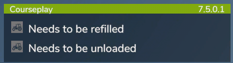

# Infó panel

  
Ez az információs panel, az egérkurzorral mozgatható, akárcsak a Mini HUD.  
A Mod neve és verziója mellett a Courseplay segítők állapotinformációit is megjeleníti.  
Miközben az állapotüzenetet mutatja, a jármű neve jelenik meg.  
Ha rákattintasz, közvetlenül a járműbe lehet ülni.  

  
Az információk a következők:  
- Valamiért elakadt  
- Valamiben elakadt  
- Hamarosan tankolni kell!  
- Üzemanyagszint alacsony!  
- A jármű javításra szorul!  
- Az eszköz kiürült!  
- Az eszköz megtelt!  
- készen van  
- Kombájnhoz vezetés  
- Pótkocsihoz vezetés  
- elfogyott a pénz  
- Várja hogy elálljon az eső  
- Várja hogy elolvadjon a hó  
- Várakozás a kirakodóra  
- letért az útvonalról, megállt  
- Rossz bálatípus  
- Útvonal nem található  
- Talajra billentés nem lehetséges  
- A vágóasztal nem támogatott  
- Vágóasztal felcsatolás kikapcsolva  
- Nem megfelelő évszak ehhez a terményhez  
- Helytelen vetőmag kiválasztva a megbízáshoz  
- A raklapok tele vannak  
- Nincs raklap  

