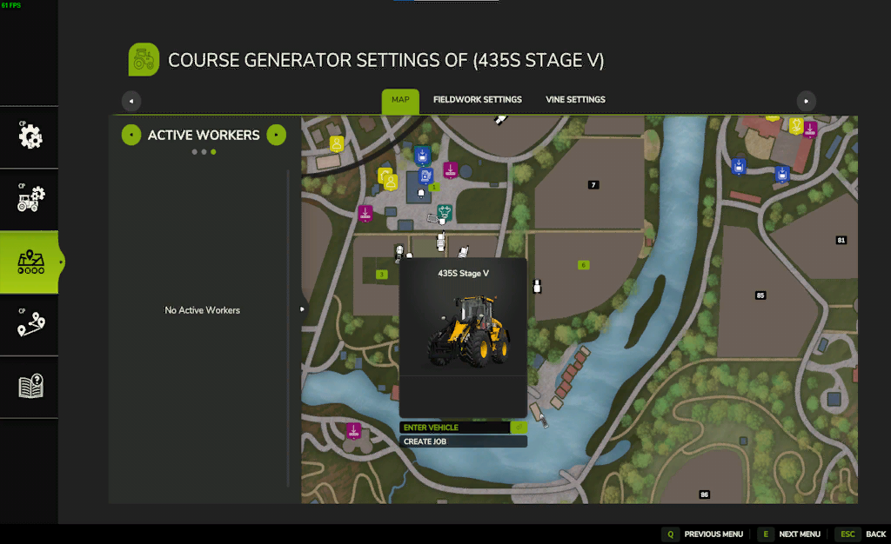
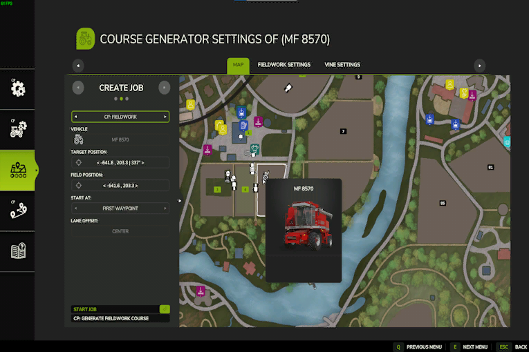

# Menu IA esteso

  
Le impostazioni dell'assistente sono ora sotto il nostro nuovo menu "Impostazioni dell'assistente".  
Funziona in modo simile al vecchio menu IA.  
Seleziona un veicolo nel menu IA per creare un lavoro, in base agli strumenti allegati o al veicolo selezionato.  
Accanto alla mappa e alle impostazioni del lavoro, troverai le impostazioni per il generatore di percorsi e il generatore di percorsi vine in alto. Sono accessibili solo con uno strumento valido quando crei un lavoro.  
Per generare un percorso e avviare i lavori Courseplay, dovrai creare il lavoro CP: Lavoro sul campo con uno strumento o un veicolo valido.  
Suggerimento: Per ottenere un accesso più rapido, puoi cliccare su "nessun percorso" sull'HUD. Questo ti porterà al menu con un lavoro già creato per il veicolo.  

  
Per iniziare con il tuo primo lavoro CP, dovresti selezionare un veicolo e un possibile attrezzo valido supportato per il lavoro.  
Quindi, cliccando su crea lavoro, puoi selezionare un lavoro CP per l'attrezzo o il veicolo selezionato.  

  
Con un lavoro CP selezionato, è necessario posizionare la posizione del campo su un campo per generare il percorso o utilizzare il cercatore di balle su di esso.  
La posizione controlla anche approssimativamente il punto di partenza del tuo percorso.  
Se vuoi usare l'aiutante Giants per guidare fino al campo, devi anche impostare la posizione obiettivo vicino al punto di partenza del percorso.  
L'impostazione della compensazione della corsia viene utilizzata solo se si desidera avere più assistenti che lavorano sullo stesso campo. Per questo, controlla la pagina del menu di aiuto separata di seguito.  
Suggerimento:Sei già su un campo quando attraversi. "nessun percorso" Quando arrivi a questo menu, i marcatori sono già posizionati sul campo.  

  
Quando la posizione del veicolo è posizionato correttamente su un campo, vedrai il bordo del campo disegnato sulla mappa.  
Se stai creando un lavoro CP: Lavoro sul campo, avrai accesso alle impostazioni del generatore del percorso.  

  
Ora è possibile avviare il driver direttamente dal menu. L'aiutante dei Giants guiderà fino alla posizione di destinazione e da lì il lavoro CP subentrerà automaticamente.   
In alternativa, puoi anche avviare il driver dall'HUD se sei vicino al campo con il veicolo o utilizzando la mod AutoDrive per consegnare il lavoro CP vicino al campo.  

