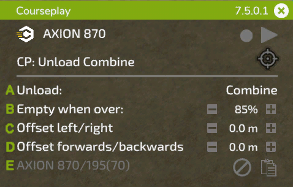

# Mini HUD

## Generale

  
A: Tieni premuto il pulsante sinistro del mouse sul titolo per trascinare l'HUD nella posizione che preferisci. Sul lato destro viene mostrata la versione installata e la X chiuderà l'HUD con un clic del mouse.  
B: Fare clic sull'icona Courseplay per accedere alle impostazioni globali.  
C: In questa posizione viene visualizzato il nome del tuo veicolo. Facendo clic su di esso si accederà al menu delle impostazioni del veicolo.  
D: Questi simboli servono a: (1) eliminare il percorso attualmente caricato, (2a) cambiare la modalità di visualizzazione del percorso, (2b) se non è caricato alcun percorso, viene visualizzato un pulsante di registrazione per registrare un percorso al confine del campo, (3) avviare o fermare l'aiutante.  
E: Questa icona di destinazione ha diverse opzioni a seconda della modalità selezionata, apre il menu IA con il lavoro ed è in grado di posizionare marcatori e impostazioni aggiuntive per il lavoro. Sul lato sinistro dell'icona, con un lavoro sul campo in corso, viene mostrato il tempo rimanente del percorso.  
F: Fai clic sul testo per attivare/disattivare le modalità disponibili per i tuoi atrezzi attuali.  
G: Le impostazioni visualizzate sotto questa riga dipendono dal lavoro corrente. Questi verranno spiegati con le seguenti immagini.  

## Lavoro sul campo

  
A: Fare clic per selezionare dove iniziare il lavoro. Se è caricato un percorso multi attrezzo, sul lato destro è possibile selezionare la corsia.  
B: Visualizza il nome del percorso caricato. Se hai appena generato un percorso, verrà visualizzato 'percorso temporaneo'. Sul lato destro vedrai i waypoint attuali/totali una volta avviato il lavoro.  
C: Cliccando sul testo verrà ricalcolata la larghezza di lavoro, oppure è possibile impostarla manualmente sulla destra cliccando +/-, oppure con la rotellina del mouse sopra il numero.  
D: Alcuni atrezzi necessitano di un offset laterale. Courseplay lo calcolerà automaticamente quando si fa clic sul testo, oppure puoi modificarlo manualmente proprio come la larghezza di lavoro.  
E: Utilizzare il simbolo sul lato destro per copiare il percorso corrente negli appunti. Il nome del percorso copiato verrà quindi mostrato a sinistra. Puoi caricare il percorso copiato su un altro veicolo che non ha ancora un percorso. Per rimuovere il percorso dagli appunti, fare clic sul simbolo Rimuovi.  

## Scaricatore per mietitrebbie

  
A: Seleziona il tipo di veicolo che il lavoratore dovrà scaricare. Ciò è utile se si utilizzano tipi diversi, come una mietitrebbia e un caricatore come il ROPA Maus, che lavorano sullo stesso campo.  
B: Imposta il livello di riempimento (40% - 100%) che il lavoratore deve raggiungere al luogo di scarico. Fare clic su +/- o utilizzare la rotella di scorrimento sul numero da modificare.  
C: A volte la posizione dello scaricatore sotto il tubo non è perfetta. Ciò può essere dovuto al rimorchio o al tubo della mietitrice, a volte causato dalla pendenza del campo. Qui è possibile correggere manualmente la distanza dalla mietitrice.  
D: Come sopra, ma qui è possibile regolare la posizione dello scaricatore rispetto al tubo in avanti o indietro.  
E: Similmente alla copia di un percorso, qui puoi copiare le posizioni dei marker su un altro veicolo.  

## Raccolta/avvolgimento delle balle

  
A: Balle rimanenti sul campo.  
B: Tipologia delle balle da raccogliere/avvolgere.  
C: Offset tra la linea centrale del trattore e la linea centrale del braccio caricatore. Potrebbe essere necessario regolarlo per trattori più grandi (ad esempio con pneumatici più larghi).  

## Caricatore silos

  
A: Dimensione rimanente del mucchio in litri.  
B: Larghezza di lavoro, identica a quella del lavoro sul campo.  
C: Courseplay richiede che l'altezza esatta della benna dal suolo sia impostata correttamente. Poiché questa altezza può essere diversa per ogni strumento, puoi controllarla e regolarla con questa impostazione.  
D: Proprio come con lo scaricatore, puoi copiare le posizioni dei marker su un altro veicolo.  

## Lavoratore del silos

  
A: Similmente al caricatore del silo, l'altezza della livellatrice è fondamentale. Puoi regolarlo qui.  
B: Mostra l'avanzamento della compattazione. Facendo clic su di esso, si attiva/disattiva l'opzione per arrestare il driver una volta raggiunta la compattazione completa.  
C: Qui è possibile modificare la larghezza di lavoro quando necessario.  
D: Questa impostazione indica al lavoratore di attendere nel silos o in una posizione di parcheggio selezionata quando un dispositivo di scarico si avvicina al silos.  

