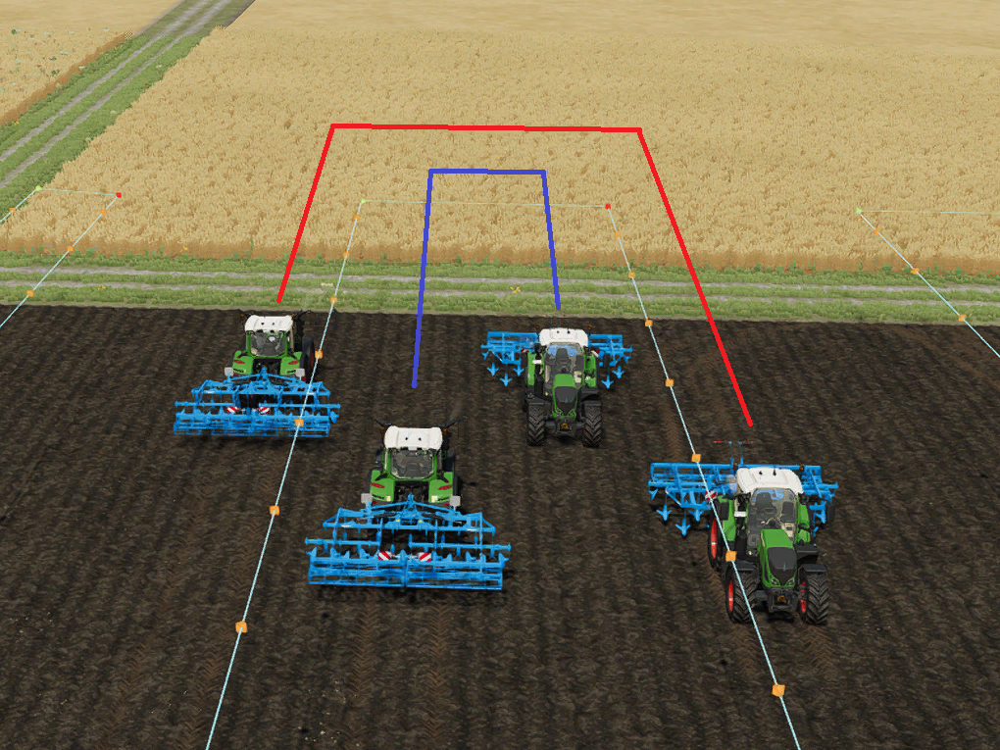

# Cambio corsia simmetrico

  
Il cambio di corsia viene utilizzato nei percorsi multi-strumento e indica all'aiutante in quale corsia deve guidare dopo la svolta.  
Con il cambio di corsia attivo, il veicolo cambia lato dopo ogni svolta.  
È un po' difficile da capire, quindi diamo un'occhiata a due esempi.  

  
Se il cambio corsia è disattivato, il veicolo rimane sullo stesso lato per tutto il percorso da cui è partito.  
Se è partito dalla corsia più a sinistra, rimarrà sempre nella corsia più a sinistra. Questo evita conflitti con gli altri conducenti,  
ma i veicoli all'interno della curva (quelli più a sinistra per le curve a sinistra,   
quelli più a destra per le curve a destra) dovranno fare curve più strette mentre proseguono sulla corsia adiacente.  

  
Se è attivo il cambio corsia, ad esempio per due veicoli, il veicolo A a sinistra e il veicolo B a destra, dopo la svolta le corsie vengono cambiate.  
Ciò significa che A è quindi sulla destra e B è quindi sulla sinistra.  
Il vantaggio è che tutti i veicoli hanno la stessa larghezza di svolta e quindi la stessa distanza da percorrere.  
Per le mietitrebbie questa impostazione è importante, poiché assicura che il tubo resti fuori dal frutto e non lo raggiunga in un'altra corsia.  
Lo svantaggio è che i veicoli hanno la possibilità di scontrarsi tra loro quando guidano l'uno verso l'altro su corsie vicine.  
  
Se dai un'occhiata all'ordine delle corsie, da sinistra a destra, sarà chiaro:  
Senza cambio simmetrico: sinistra, destra, sinistra, destra - è quasi come saltare una corsia.  
Con cambio simmetrico: sinistra, destra, destra, sinistra - da sinistra a destra, una corsia dopo l'altra.  
Nell'esempio con la mietitrebbia significa che nessuna mietitrebbia avrà frutti a sinistra e a destra della sua corsia.  

