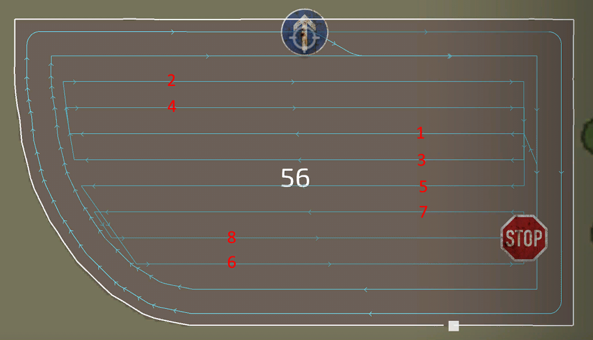

# Course generator center

  
For the center of the field, different strategies are available to do the work. Mostly the selected tool is a reason to choose a specific strategie over the other. The available strategies where created based on feedback and informations from our community.  
The simple up down strategie works almost every time for any tool. But it can be better to choose another, for example when harvesting with a combine, lands is a better way to keep the pipe outside of the fruit for a more efficient unloading.  
For Chopping, racetrack can be a better solution for less narrow turns to make the work for the unloader easier.  
Spirale is a better solution for towed harvester with an offset, to keep the tool in the fruit and the tractor outside.  

  
- Field center: There are different modes on how your field center pattern should look like. The classic and most used one is up/down.  
Spiral, Racetrack and Lands have their own specific advantages over the others. Lands for example will have the combine's pipe point out of the fruit most of the time to easier unload them.  
- Center direction: Works the same as the headland, but can now be set independantly.  
- Even row width: If the center of a field have a total width, that can't be evenly split over the work width of the tool, the 1st or last line will have a narrow rest work. To prevent this the width of each row gets reduced to have a even split over all lines.  
- Row direction: automatic mostly finds the best direction, but sometimes the longest edge fits better. If you are not happy with either one, choose manual and set the direction manually.  
- Row angle: When the row direction is set to manual, this setting appears and will tell the generator the direction of the rows.  
  
These settings appear only for specific settings you have done before:  
- Rows to skip: Appears when field center is set to "up/down". This is a very helpful option to accelerate your work, as tools won't have to back up to turn into the next row.  
- Rows per Land: Appears when field center is set to "lands". This has only impact when the field center is set to lands and will tell the generator how many rows each land should have. The more rows, the fewer lands will be generated.  
- Spiral from inside: Appears when field center is set to "spiral".  
- Number of circles: Appears when field center is set to "racetrack".  

## 
up/down

## 
lands

## 
spiral

## 
racetrack

