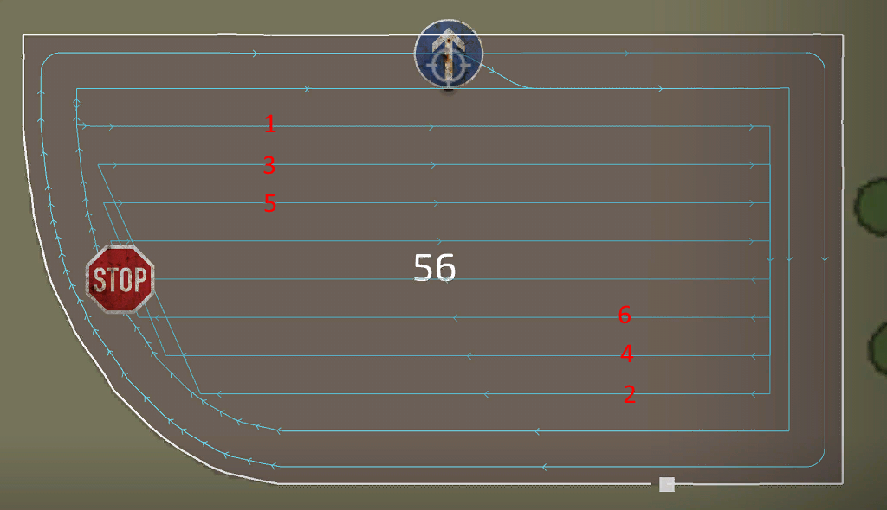

# 중앙 경로 생성기

  
필드 중앙에서 작업을 수행하는 여러 가지 전략을 사용할 수 있습니다.   
대부분 선택한 도구에 따라 적합한 전략이 달라지며, 이러한 전략들은 커뮤니티의 피드백과 정보에 기반하여 개발되었습니다.  
가장 기본적인 상하(up/down) 방식은 거의 모든 도구에서 잘 작동합니다.   
하지만 상황에 따라 다른 방식이 더 적합할 수 있습니다.   
예를 들어 콤바인으로 수확할 때 '구획(Lands)' 방식을 사용하면 파이프가 작물 밖을 향하도록 유지할 수 있어 하역이 더 효율적입니다.  
사료를 수확하는 경우, '레이스트랙(Racetrack)' 방식이 더 적합하며, 좁은 회전 반경을 줄여 언로더의 작업이 쉬워집니다.  
'나선형(Spiral)' 방식은 간격이 있는 견인형(Towed) 수확기에 적합하며, 도구는 작물 내에서 작업하고 트랙터는 외부에서 주행할 수 있도록 합니다.  

  
- 필드 중앙(Field center): 필드 중앙 패턴을 설정하는 여러 가지 모드가 있습니다.   
  가장 일반적으로 사용되는 방식은 상하(up/down) 방식입니다.  
  나선형(Spiral), 레이스트랙(Racetrack), 구획(Lands) 등은 각각 고유한 장점이 있습니다.   
  예를 들어, '구획(Lands)' 방식은 콤바인의 파이프가 작물 밖을 향하도록 유지하여 하역을 쉽게 할 수 있습니다.  
- 중앙 방향(Center direction): 헤드랜드 방향과 동일한 방식으로 작동하지만, 이제 개별적으로 설정할 수 있습니다.  
- 행 폭 균등화(Even row width):   
  필드 중앙이 특정 너비를 가지지만 도구의 작업 폭과 정확히 일치하지 않는 경우, 첫 번째 또는 마지막 줄이 좁은 작업 구역을 가질 수 있습니다.  
  이를 방지하기 위해 각 줄의 너비를 조정하여 균등한 간격을 유지하도록 설정할 수 있습니다.  
- 행 방향(Row direction): 자동(Auto) 설정이 대부분 최적의 방향을 찾지만, 때때로 가장 긴 가장자리가 더 적합할 수도 있습니다.  
  원하는 방향이 나오지 않으면 수동(Manual)으로 설정하여 직접 방향을 지정할 수 있습니다.  
- 행 각도(Row angle): 행 방향(Row direction)을 '수동'으로 설정하면 활성화됩니다. 이 값을 조정하면 생성기의 행 방향이 설정됩니다.  
  
이 설정들은 특정 조건에서만 활성화됩니다:  
- 건너뛸 행(Rows to skip): 필드 중앙이 "상하(up/down)" 방식으로 설정되었을 때 나타납니다.   
  이 설정을 활성화하면 도구가 다음 행으로 진입할 때 후진할 필요가 없어 작업 속도를 더욱 높일 수 있습니다.  
- 구획당 행 수(Rows per Land): 필드 중앙이 "구획(Lands)" 방식으로 설정되었을 때만 나타납니다.  
  생성기에서 각 구획에 몇 개의 행을 포함할지 결정하는 값입니다. 값이 클수록 생성되는 구획 수는 줄어듭니다.  
- 내부에서 시작(Spiral from inside): 필드 중앙이 "나선형(Spiral)"으로 설정되었을 때만 나타납니다.  
- 원형 주행 횟수(Number of circles): 필드 중앙이 "레이스트랙(Racetrack)"으로 설정되었을 때만 나타납니다.  

## 
상하(up/down)

## 
구획(Lands)

## 
나선형(Spiral)

## 
레이스트랙(Racetrack)

