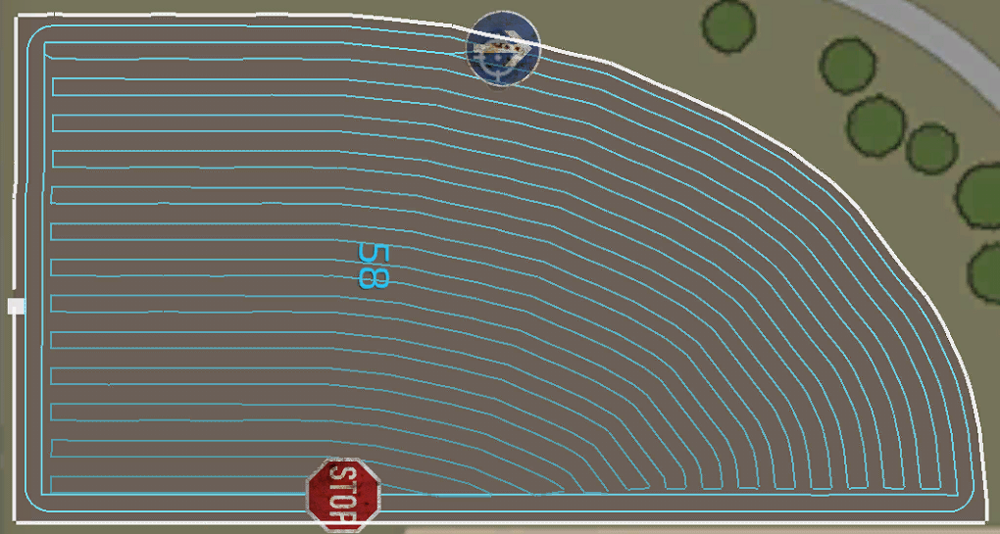

# 경로 생성기 - 전문가 모드

  
일부 설정은 Courseplay 전역 설정에서 전문가 모드를 활성화해야만 표시됩니다.  
이 설정을 변경하기 전에, 먼저 기본 설정이 어떻게 작동하는지 충분히 숙지하는 것이 좋습니다.  
또한 일부 전문가 모드 설정은 특정 조건에서만 정상적으로 작동합니다.  
  
- 다중 작업(Multiple Tools): 동일한 경로에서 둘 이상의 차량이 작업하도록 설정하는 옵션입니다. 다소 복잡한 설정이므로 별도의 도움말 항목이 제공됩니다.  
- 좁은 필드(Narrow field): 헤드랜드를 필드의 짧은 두 가장자리에만 생성합니다. 이 경우, 헤드랜드에서 차량이 필드 안에서만 이동하는 것이 불가능할 수 있습니다.  
- 헤드랜드 중첩(Headland overlap): 기본값이 항상 사용되며, 이 값을 변경할 수 있습니다.   
  헤드랜드 중첩은 필드 내부에서만 이루어지며, 필드 경계를 벗어나지 않습니다.  
- 필드 여백(Field margin): 필드 경계를 원래보다 안쪽 또는 바깥쪽으로 이동할 수 있도록 조정하는 설정입니다.  
- 기준선 가장자리 사용(Use base line edge): 특정 필드에서만 작동하는 완전히 새로운 기능입니다.  
  필드 경계가 길게 곡선을 이루는 경우, 필드 마커를 그 근처에 배치하면 중앙선이 해당 경계를 따라 생성됩니다.  
  **중요:** 생성된 경로가 완벽하지 않거나 품질이 좋지 않다면, 선택한 가장자리 또는 필드가 이 기능과 호환되지 않는 것입니다.    
  이 기능에 대한 추가 업데이트는 제공되지 않습니다.  

