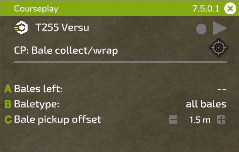

# 미니 HUD

## 일반

  
A: 헤드라인에서 왼쪽 마우스 버튼을 누른 상태로 드래그하여 HUD 위치를 원하는 곳으로 이동할 수 있습니다.    
   오른쪽에는 설치된 버전이 표시되며, 'X' 버튼을 클릭하면 HUD가 닫힙니다.    
B: Courseplay 아이콘을 클릭하면 전역 설정에 접근할 수 있습니다.    
C: 현재 차량의 이름이 표시됩니다. 클릭하면 차량 설정 메뉴로 이동합니다.    
D: 이 아이콘들은 다음 기능을 수행합니다: (1) 현재 로드된 경로 삭제 (2a) 경로 표시 방식 전환 (2b) 경로가 로드되지 않은 경우, 필드 경계 경로를 녹화할 수 있는 녹화 버튼 표시, (3) 작업자 시작 또는 중지  
E: 이 목표 아이콘은 선택한 모드에 따라 다르게 작동하며, AI 메뉴를 열어 작업을 설정하거나 마커 및 추가 설정을 배치할 수 있습니다.    
   아이콘 왼쪽에는 필드 작업이 실행 중일 때, 남은 경로 시간이 표시됩니다.    
F: 텍스트를 클릭하면 현재 도구에 사용 가능한 모드를 전환할 수 있습니다.    
G: 이 선 아래에 표시되는 설정은 현재 작업에 따라 달라집니다. 다음 그림에서 자세히 설명됩니다.    

## 필드 작업

  
A: 작업을 시작할 위치를 선택하려면 클릭하세요.    
   다중 작업(multi-tool) 경로가 로드된 경우, 오른쪽에서 차선을 선택할 수 있습니다.    
B: 불러온 경로의 이름이 표시됩니다. 새로 생성된 경로의 경우 '현재 주행 거리'가 표시됩니다.    
   작업이 시작되면, 오른쪽에 현재/전체 웨이포인트 수가 표시됩니다.    
C: 텍스트를 클릭하면 작업 폭이 다시 계산됩니다.    
   오른쪽에서 + 또는 - 버튼을 클릭하여 수동으로 설정할 수도 있으며, 숫자 위에서 마우스 휠을 사용하여 조정할 수도 있습니다.    
D: 일부 도구는 측면 간격이 필요합니다.    
   Courseplay는 텍스트를 클릭하면 이를 자동으로 계산하지만, 작업 폭과 동일한 방식으로 수동 조정도 가능합니다.    
E: 오른쪽 아이콘을 클릭하면 현재 경로를 클립보드에 복사할 수 있습니다.    
   복사된 경로의 이름은 왼쪽에 표시됩니다.    
   아직 경로가 없는 다른 차량에서 복사한 경로를 불러올 수 있습니다.    
   클립보드에서 경로를 제거하려면 '삭제' 아이콘을 클릭하세요.    

## 콤바인 하역

  
A: 작업자가 어떤 유형의 차량에 하역할지 선택합니다.    
   이는 동일한 필드에서 콤바인과 ROPA Maus 같은 로더가 함께 작업할 경우 유용합니다.    
B: 작업자가 하역 지점으로 이동할 필터 기준(40% - 100%)을 설정합니다.    
   + / - 버튼을 클릭하거나 숫자 위에서 마우스 휠을 사용하여 조정할 수 있습니다.    
C: 때때로 하역 차량이 콤바인의 파이프 아래에서 정확한 위치를 잡지 못할 수 있습니다.    
   이는 트레일러나 수확기의 파이프 위치, 혹은 필드의 경사도에 의해 발생할 수 있습니다.    
   여기에서 콤바인과의 거리를 수동으로 조정할 수 있습니다.    
D: 위 설정과 유사하지만, 여기에서는 하역 차량이 파이프에 대해 전방 또는 후방으로 얼마나 위치할지 조정할 수 있습니다.    
E: 경로 복사와 유사하게, 여기에서 마커 위치를 다른 차량으로 복사할 수 있습니다.    

## 베일 수거/포장

  
A: 필드에 남아 있는 베일 수량.    
B: 수거 또는 포장할 베일 유형.    
C: 트랙터 중앙선과 로더에서 수거하는 부분의 중앙선 사이의 간격.    
   더 큰 트랙터(예: 넓은 타이어 장착)에서는 이 값을 조정해야 할 수도 있습니다.    

## 사일로 로더

  
A: 남은 더미 크기(리터 단위).    
B: 작업 폭, 필드 작업과 동일한 방식으로 설정됩니다.    
C: Courseplay는 버킷이 지면 위에서 정확한 높이에 있어야 정상적으로 작동합니다.    
   각 도구마다 적절한 높이가 다를 수 있으므로, 이 설정을 사용하여 확인 및 조정할 수 있습니다.    
D: 하역 차량과 마찬가지로, 여기에서도 마커 위치를 다른 차량으로 복사할 수 있습니다.    

## 사일로 작업자

  
A: 사일로 로더와 마찬가지로, 레벨러의 높이가 중요합니다.    
   여기에서 높이를 조정할 수 있습니다.    
B: 압축 진행률을 표시합니다.    
   클릭하면 압축이 완료되었을 때 작업자가 멈추도록 설정할 수 있습니다.    
C: 필요에 따라 작업 폭을 조정할 수 있습니다.    
D: 하역 차량이 사일로에 접근할 때, 작업자가 사일로 내부에서 대기할지    
   또는 선택한 주차 위치에서 대기할지를 설정합니다.    

