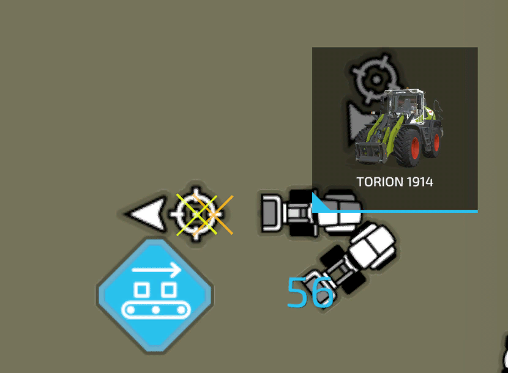

# Wheelloader Driver

  
This mode enables wheel loader and tractors with a front loader.   
With a shovel attached a heap can be picked up from the ground or loading from a bunker silo can be accomplished.  
The picked up fill level can be unloaded automatically into a nearby trailer or a selected unloading station like a BGA.  
The shovel will automatically be moved to the correct positions for loading, unloading and so on.  
In case the mode is not directly visable on the hud, you can toggle the "start position" until the shovel mode appears.  
  
The target icon on the hud can be used to open the AI map to select the loading and the unloading targets.  
The hud also shows the leftover fill level of the heap or silo, while the helper is working.  
If the loading target is a bunker silo, then the work width might need to be adjusted to avoid hitting the side walls of the silo.  
  
The hight offset setting is used to adjust the hight above the ground, as not all shovel can calculated correctly.   
This should be checked, if the shovel is to low for loading and the driver can't turn anymore or the shovel is to high and fill level is missed to the ground.  
If the value gets changed, the shovel will automatically move to the loading position to show the impact of the offset.  
To reset the offset you need to click on the settings text in the hud. The value can be adjusted from +1 to -1 in 0.1 setps.  
  
Shovels with a silage grab will open and close automatically for loading and unloading.  
The shovel to shred sugar beets is completly functional as well.  

  
To start a wheel loader helper, you need to set the load and unload positions by clicking the target icon on the hud.  
The loading position works the same like the one from the loader mode. A blue square will be created arround the heap.  
  
The unloading position depends if you want to unload into a trailer or into an unloading station.  
If unloading into the trailer is selected, then the area where the trailer will be parked needs to be selected on the AI Menu.  
The helper will drive to any parked trailer in the area. The direction of the marker has no real meaning.  
If you want to unload into an unloading station, you need to switch the target and then mark the trigger with the unloading position.  

  
Selecting a trigger does look a bit complicated at first, but in reality it is really easy.  
Every building can have more then one trigger so you have to choose the one you want to unload to.  
All available triggers will be shown with an orange cross on the AI Map.  
To select one place the middle of the round marker on the middle of the cross.  
The driection of the arrow tells the helper from which direction he will approach the trigger for unloading.  
Now your selection should look similar to the image.  

