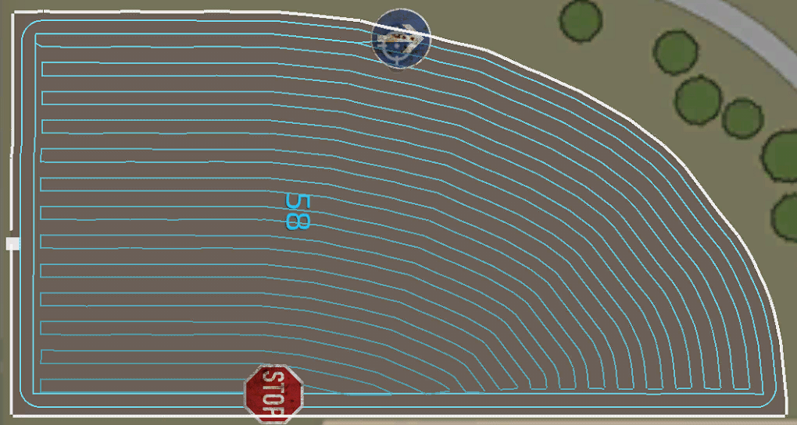

# Generator kursu - zaawansowane

  
Niektóre ustawienia są widoczne tylko po włączeniu trybu zaawansowanego w globalnych ustawieniach.  
Zanim zaczniesz bawić się tymi ustawieniami, upewnij się, że wiesz, co robią ustawienia podstawowe.  
Niektóre ustawienia zaawansowane działają poprawnie tylko w określonych warunkach.  
  
- Wiele maszyn: To ustawienie jest używane, gdy na kursie ma pracować więcej niż tylko jeden pojazd. Ponieważ jest to nieco bardziej skomplikowane, istnieje osobny temat pomocy.  
- Zamiana pasów: Jeśli ta opcja jest aktywna, strona pojazdu będzie wyświetlana jako "zmieniona", ale nawrót zawsze będzie miał tę samą długość. Po więcej informacji sprawdź menu dodatkowej pomocy "Zmiana pasów".  
- Obrys pola: To ustawienie umożliwia przesunięcie obrysu pola do wewnątrz lub na zewnątrz oryginalnego.  
- Wąskie pole: Tworzy uwrocie tylko na dwóch krótkich krawędziach pola. W takim przypadku nie jest możliwe utrzymanie pojazdu na polu na najdłuższych krawędziach uwrocia.  
- Nakładka na uwrociach: Istnieje wartość domyślna, która będzie zawsze używana. Wartość tę można zmienić za pomocą tego ustawienia. Nakładka będzie tylko wewnątrz pola i nie będzie nachodzić na granicę pola.  
- Użyj krzywizny krawędzi: Zupełnie nowa funkcja, która działa tylko na określonych polach. Jeśli masz pole z długą nieregularną krawędzią i umieścisz znacznik pola w jej pobliżu, linia ścieżki zostanie wygenerowana względem tej krzywizny.  
WAŻNA UWAGA: Jeśli wygenerowany kurs nie będzie idealny lub nawet zły przez wybraną krawędź lub pole, nie będzie on działał z tą funkcją. Nie będzie również żadnej aktualizacji tego!  

