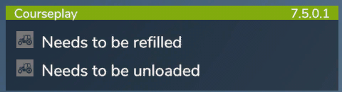

# Panel informacyjny

  
To jest nasz panel informacyjny, można go przesuwać za pomocą myszki, podobnie jak nasz mini HUD.  
Oprócz nazwy i wersji naszego modu, pokazuje również informacje o statusie kierowców CP.  
Podczas najeżdżania na komunikat o stanie zostanie wyświetlona nazwa pojazdu.  
Klikając na nią, możesz wskoczyć bezpośrednio do pojazdu.  

  
Informacje są następujące:  
- Utknął  
- Zablokowany przez obiekt  
- Powinien zostać zatankowany  
- Musi zostać zatankowany  
- Musi zostać naprawiony  
- Musi zostać załadowany  
- Musi zostać rozładowany  
- Zakończył pracę  
- Brak pieniędzy  
- Oczekuje na koniec opadów  

