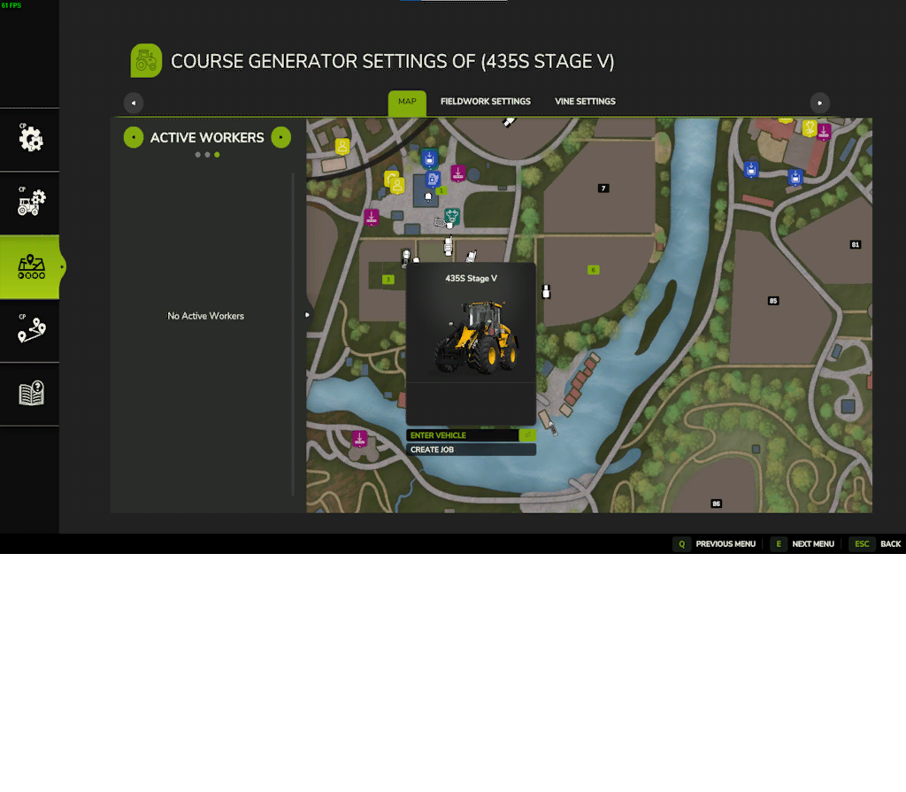

# Menu Avançado

  
Primeiro precisamos de selectionar um veículo no menu para gerar uma rota para um serviço num campo ou para aceder ás configurações do veículo ou o gestor de rotas.  
A rota presente irá estar demonstrada no mapa.  
As configurações globais estão sempre visiveis.  
Para gerar uma rota e começar o serviço no campo, primeiro tem de se criar um serviço, ou para apanhar os fardos ou embala-los, assim como na ajuda da Giants.  

  
Para começar com o primeiro serviço, tem de selecionar um veículo e uma alfaia válida que seja suportado para esse mesmo serviço.  
Então, ao clicar em criar trabalho, pode-se selecionar entre o serviço no campo ou de para apanhar ou enrolar os fardos  
com o enrolador de fardos ou com a alfaia de apanhar fardos.  

  
Para começar com seu primeiro trabalho de CP, você teria que selecionar um veículo e um possível implemento válido que seja suportado para o trabalho.  
Então, clicando em criar trabalho, você pode selecionar CP: Trabalho de campo para ferramentas de trabalho de campo ou CP: embrulhar/coletar  
com um empacotador de fardos ou coletor de fardos anexado.  

  
Quando a posição do campo é colocada corretamente em um campo, você verá a borda do campo desenhada no mapa.  
Se você estiver criando um trabalho CP: Trabalho de campo, você terá acesso às configurações do gerador de curso.  

  
Agora é possível iniciar o driver diretamente do menu. O ajudante do Giants irá dirigir até a posição alvo e a partir daí o trabalho de CP assume automaticamente.  
Alternativamente, você também pode iniciar o motorista a partir do HUD se estiver perto do campo com o veículo ou usando o mod AutoDrive para entregar o trabalho de CP perto do campo.  

