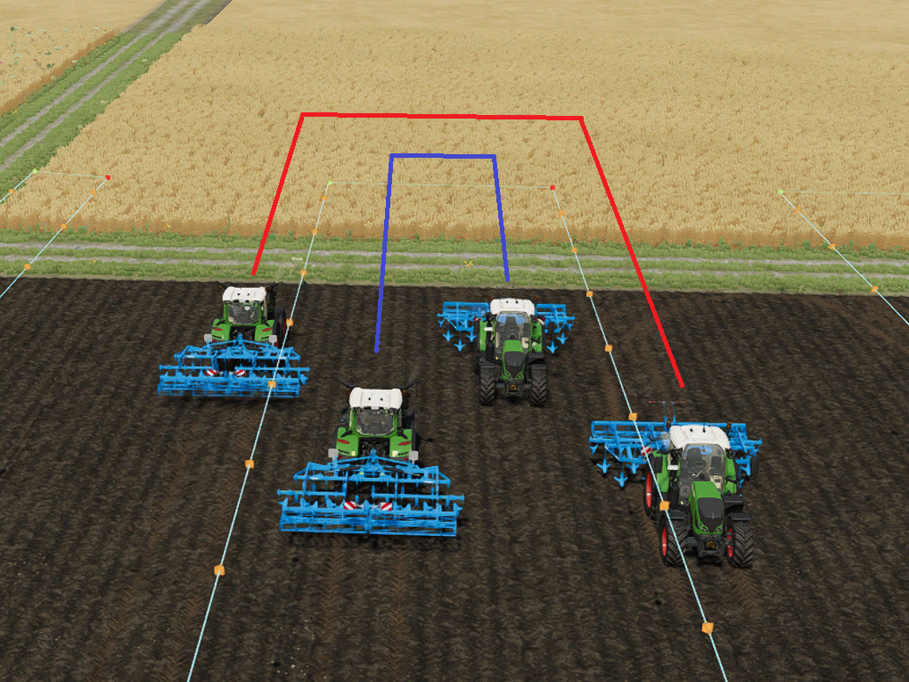
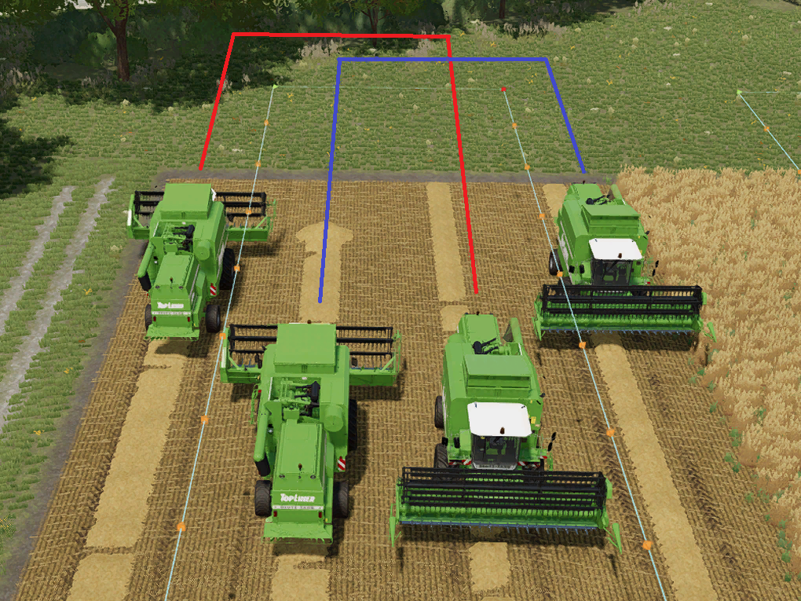

# Mudança de faixa simétrica

  
A mudança de faixa simétrica é usada em rotas multi implementos e informa ao motorista em qual faixa ele deve dirigir após a curva.  
Isso é um pouco difícil de entender, então vamos dar uma olhada em dois exemplos.  

  
Quando a mudança de faixa simétrica é desativada, o veículo permanece em sua faixa de deslocamento.  
Isso significa que ele sempre dirige para a esquerda ou para a direita da rota.  
Isso garante que os veículos não estejam dirigindo lado a lado.  
Não haverá risco de conflito com outro motorista.  

  
Se a mudança de faixa simétrica estiver ativada, a esquerda e a direita serão trocadas (mas não mostradas no HUD).  
Os veículos podem entrar em conflito uns com os outros, quando se dirigem um para o outro.  
Qual é a vantagem da mudança de faixa simétrica então?  
Se você der uma olhada na ordem das faixas, da esquerda para a direita, ficará claro:  
Sem mudança simétrica: esquerda, direita, esquerda, direita - é quase como pular uma faixa.  
Com mudança simétrica: esquerda, direita, direita, esquerda - da esquerda para a direita, uma faixa após a outra.  
No exemplo com a colheitadeira, significa que nenhuma colheitadeira terá frutas à esquerda e à direita de sua faixa  

