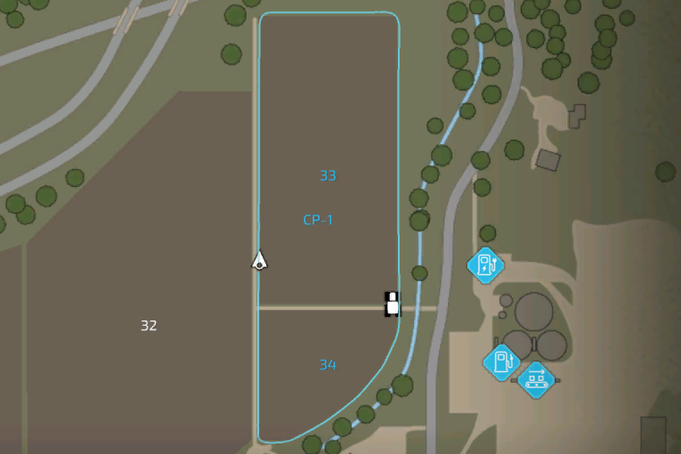
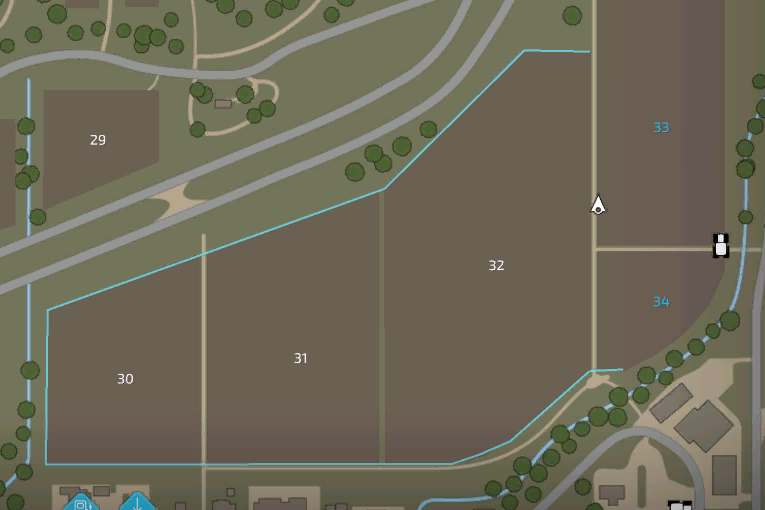

# Custom Fields

  
  
There are two ways to create custom fields.  
  
The first one is to use the record function of the HUD.  
  
First press the course record button and then drive the field border that you want to record.  
  
Once your finished, simply press the button again and you will be asked if you want to save it.  
  

  
  
The custom field borders will be displayed in the AI menu.  
  
By clicking on the name you will get the option to either delete or rename it.  
  

  
  
The second option is to draw the custom field on the map of the AI menu.  
  
If no hotspot is selected, you can press the draw custom field button below.  
  
After that a text appears on the top of your screen.  
  
Start by clicking the right mouse button for setting the start position.  
  
The next clicks will create lines to the previous click.  
  
Click the save button at the bottom to finish drawing the field.  
  

