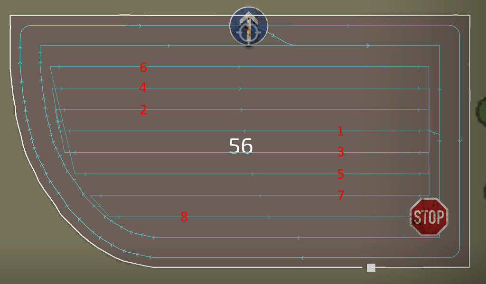

# Генератор курсов: метод движения

  
Для основной части курса доступны различные методы выполнения работ. В основном основанием для выбора того или другого метода является выбранный инструмент. Доступные для выбора методы созданы на основе обратной связи и информации от нашего сообщества.  
Простой челночный режим работает почти для любого инструмента. Но может быть лучше выбрать другой, например, при уборке комбайном, движение загонами - лучший способ удержать трубу за пределами неубранных культур для более эффективной разгрузки.  
Для кормоуборочного комбайна кольцевой режим может быть лучшим решением для менее узких поворотов, чтобы облегчить работу для разгрузчика.  
Круговой метод является лучшим решением для буксируемого комбайна со смещением, чтобы удерживать инструмент в убираемой культуре, а трактор снаружи.  

  
- Метод движения: Существуют разные режимы того, как должен выглядеть ваш рабочий участок центра поля. Классический и наиболее используемый - челночный (вверх/вниз).  
Круговой, кольцевой и загонами имеют свои конкретные преимущества перед другими. Например, при выборе метода 'загонами' у вас выгрузная труба для разгрузки комбайна большую часть времени будет не над неубранными культурами.  
- Направление основного курса: работает так же, как и для разворотной полосы, но теперь может быть установлено независимо.  
- Равномерная ширина рядов: если метод движения имеет общую ширину, которую нельзя равномерно разделить проходы по ширине работы инструмента, 1-й или последний проход будет иметь узкий рабочий проход. Чтобы предотвратить это, ширина каждого ряда уменьшается, чтобы иметь равномерное разделение на всех проходах.  
- Направление челночных проходов: лучшее направление в основном находится 'автоматически', но иногда 'длинный край' подойдёт лучше. Если вы не довольны ни одним из них, выберите 'вручную' и установите направление сами.  
- Угол челночных проходов: когда направление проходов установлено вручную, появится эта настройка и сообщит генератору направление проходов.  
  
Эти настройки появляются только для определенных настроек, которые вы сделали раньше:  
- Пропускать рядов: появляется, когда метод движения установлен на "челночный". Это очень полезный вариант для ускорения вашей работы, так как инструменты не придется резко разворачиваться на следующий проход.  
- Проходов в загоне: появляется, когда метод движения устанавливается на "загонами". Это оказывает влияние только тогда, когда метод движения устанавливается на "загонами", и сообщит генератору, сколько проходов должна иметь каждая загонка. Чем больше проходов будет сгенерировано, тем меньше будет загонок.  
- Спираль изнутри: появляется, когда метод движения устанавливается на "круговой".  
- Количество кругов: появляется, когда метод движения устанавливается на "кольцевой".  

## 
челночный

## 
загонами

## 
круговой

## 
кольцевой

