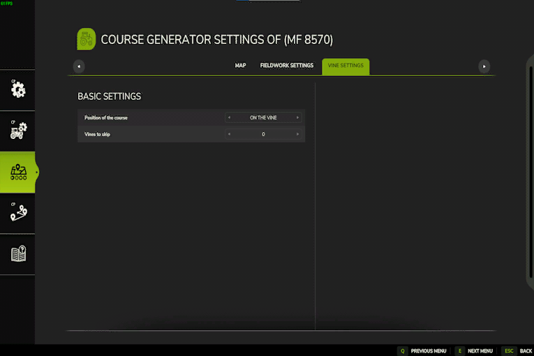

# Vinodling

  
Att arbeta med vinrankor är lite mer komplicerat och arbetar sedan på ett normalt fält.  
För att ha det bästa resultatet ska vinrankorna alla vara bredvid varandra inom standardnätet.  
Slutet och början på varje vinranka, bör också vara ungefär samma längd.  
Om vinrankorna finns på ett befintligt fält kan du öppna generatorn direkt sätt som vanligt.  
Om de inte är på ett fält måste du gå över AI-menyn och placera fältmarkören på vinrankorna.  

  
Generatorn för vinrankor har mindre alternativ.  
Beroende på verktyget måste du välja att arbeta med vinrankorna eller bredvid vinrankorna.  
T.ex. Standardskördaren måste köra och arbeta på vinrankan.  
      Förköraren måste köra åt vänster från vinrankorna men arbetar på vinrankan, så du måste välja att arbeta på vinrankan, men köra med en offset.  
      Sprutor måste köra bredvid vinrankorna och behöver hoppa över en rad, eftersom den sprayer till vänster och höger.  

  
En vinrankskurs bör genereras på vinrankorna, eftersom det fick köra och arbeta med vinrankorna.  

  
Förutbredningen fungerar på vinrankorna, så kursen måste genereras på vinrankorna.  
Verktygen kommer med en förskjutning för traktorn, så traktorn kör mellan vinrankorna.  

  
Sprutan fungerar bredvid vinrankorna så att den måste köra antingen vänster eller höger från vinrankorna.  
Eftersom sprutan kan fungera till vänster och höger vinstockar samtidigt kan vi hoppa över en rad.  

