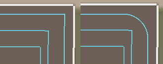

# Rota Oluşturucu: manevra koridoru

  
Manevra koridoru ayarları, yalnızca manevra koridoru sayısını en az 1 olarak belirlediğinizde görüntülenir.  
Bu ayarlarda, nereden başlanacağı, köşe ayarları, yön ve örtüşme gibi seçenekler bulunur.  
Manevra koridorları, araçların dönüş yaparken tarladan taşmalarını engellemek için kullanılır, şiddetle tavsiye edilir.  

  
-Manevra Koridoru Köşelerini Keskinleştirme: Kavisli olmayan manevra koridoru köşelerini keskinleştirir.   
Bu ayar, manevra koridorunun eğriliği aracın dönüş çapından daha küçükse, aracın manevra koridorunda dönüş manevrası yapmasını zorunlu kılar.  
-Kavisli Köşe Sayısı: En dıştaki manevra koridorundan başlayarak, kavisli köşelere sahip olacak koridorların sayısı.   
Kavisli köşeler, aracın dönüş çapına dayalıdır, bu nedenle bu koridorlarda araç dönüş manevrası yapmaz.  
-Köşe Yarıçapı: Yuvarlak köşelerin yarıçapını ayarlar. Eğer iş ekipmanınızın yarıçapı en az 10 ise, bu değeri 10 olarak ayarlayabilirsiniz.  
-Manevra Koridoru Yönü: Saat yönünde veya saat yönünün tersine. Bu ayar biçerdöverler ve hasat makineleri için boru veya konveyör bandının   
hangi tarafta olduğuna bağlı olarak önem taşır.  
-Manevra Koridoru Örtüşmesi: Bir manevra koridorunun bir sonrakiyle ne kadar örtüştüğünü belirtir. Bazı durumlarda ekin tahribatını önlemek için kullanılır.  

