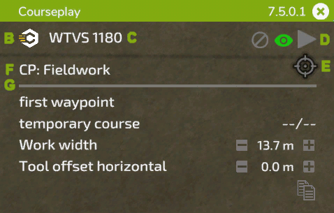
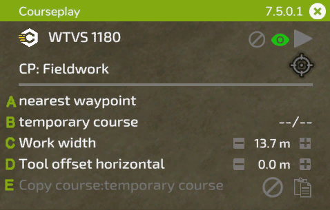
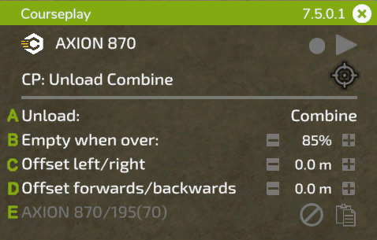
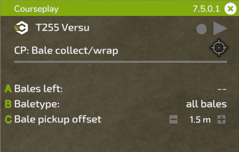
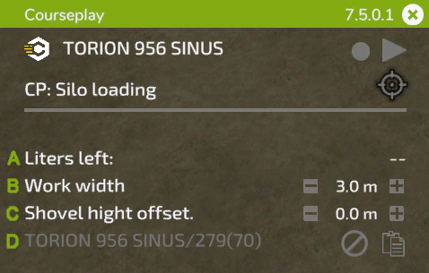
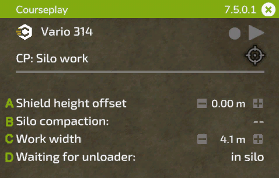

# Mini HUD

## Genel işlevler

  
A: HUD'u istediğiniz bir konuma sürüklemek için başlığa sol fare düğmesiyle basılı tutun. Sağ tarafta, yüklü versiyon gösterilir, X tıklayınca HUD kapanır.  
B: Courseplay simgesine tıklayarak genel ayarlara erişebilirsiniz.  
C: Bu bölümde aracınızın adı görüntülenir. Üzerine tıklayarak araç ayarları menüsüne geçebilirsiniz.  
D: Bu sembollerin anlamları şunlardır: (1) ayarlı olan rotayı sil, (2a) rota görüntüleme türünü değiştir, (2b) herhangi bir rota ayarlı değilse, tarla sınırı çizimi için kaydetme butonu, (3) çalışmayı başlatma ve durdurma.  
E: Bu simge, seçilen moda bağlı olarak farklı seçenekler sunar. İş için işaretçiler yerleştirmenizi ve ek ayarlar yapmanızı sağlayan YZ Menüsü'nü açar. Simgenin sol tarafında, bir tarla çalışması devam ederken rotanın tahmini kalan süresi gösterilir.  
F: Metne tıklayınca mevcut araçlarınıza uygun modlar arasında geçiş yapar.  
G: Bu çizginin altındaki ayarlar, mevcut işe bağlıdır. Bu ayarlar aşağıdaki resimlerde açıklanacaktır.  

## Tarla çalışması

  
A: Çalışmaya nereden başlanacağını seçmek için tıklayın. Eğer çoklu araç rotası yüklüyse, sağ taraftan hat seçebilirsiniz.  
B: Ayarlı rotanın adını gösterir. Yeni bir rota oluşturduysanız, 'geçici rota' olarak görünür. Çalışma başladığında sağ tarafta mevcut/toplam yol noktalarını görebilirsiniz.  
C: Metne tıklayarak çalışma genişliğini yeniden hesaplayabilir veya sağ taraftaki +/- düğmeleriyle ya da değer üzerinde fare tekerleğini kullanarak manuel olarak ayarlayabilirsiniz.  
D: Bazı araçlar yana doğru bir ofset ayarına ihtiyacı vardır. Metne tıklandığında Courseplay bunu otomatik olarak hesaplar veya çalışma genişliğinde olduğu gibi manuel olarak değiştirebilirsiniz.  
E: Mevcut rotayı panoya kopyalamak için sağdaki simgeyi kullanın. Kopyalanan rotanın adı solda görünür. Henüz rotası olmayan başka bir araca bu rotayı yükleyebilirsiniz. Panodan rotayı kaldırmak için kaldırma simgesine tıklayın.  

## Biçerdöver boşaltma

  
A: İşçinin hangi tip aracı boşaltacağını seçin. Aynı tarlada çalışan biçerdöver ve ROPA Maus gibi farklı tip araçlarınız varsa kullanışlıdır.  
B: İşçinin boşaltma noktasına gitmesi için gereken doluluk seviyesini (40% - 100%) ayarlar. Değeri değiştirmek için +/- düğmelerine tıklayın veya değer üzerinde fare tekerleğini kullanın..  
C: Bazen boşaltıcı aracın, boru altındaki yatay pozisyonu ideal olmayabilir. Bu römork veya hasat makinesinin borusundan kaynaklanabilir, bazen tarla eğimi nedeniyle de olabilir. Buradan hasat makinesine olan mesafeyi manuel olarak düzenleyebilirsiniz.  
D: Yukarıdaki ayar ile aynı şekilde, boşaltıcının boruya göre öne veya arkaya pozisyonunu ayarlayabilirsiniz.  
E: Rota kopyalamaya benzer şekilde, işaretçi konumlarını başka bir araca kopyalayabilirsiniz..  

## Balya toplama/sarma

  
A: Tarlada kalan balyaların sayısı.  
B: Toplanacak veya sarılacak balya türü.  
C: Traktörün orta noktası ile toplayıcı kolunun orta noktası arasındaki mesafe. Daha geniş lastikli büyük traktörler için bu mesafeyi ayarlamanız gerekebilir.  

## Silo doldurucu

  
A: Litre cinsinden yığında kalan miktar.  
B: Çalışma genişliği, tarla çalışması ile benzer.  
C: Courseplay'in kepçenin yerden yüksekliğini doğru şekilde ayarlaması gerekir. Bu yükseklik her araç için farklı olabileceğinden bu ayar ile kontrol edebilir ve ayarlayabilirsiniz.  
D: Tıpkı boşaltıcıda olduğu gibi, işaretçi konumlarını başka bir araca kopyalayabilirsiniz.  

## Silo çalışması

  
A: Silo doldurucuya benzer şekilde, düzleyicinin yüksekliği önemlidir. Buradan ayarlayabilirsiniz.  
B: Sıkıştırma oranını gösterir. Üzerine tıklamak, işçinin tam sıkıştırmaya ulaşıldığında durmasını sağlayacak işlevi açıp kapatır.  
C: Gerekirse çalışma genişliğini buradan değiştirebilirsiniz.  
D: Bu ayar, bir boşaltıcı siloya yaklaşırken, işçiye siloda mı yoksa seçilen park pozisyonunda mı beklemesi gerektiğini söyler.  

