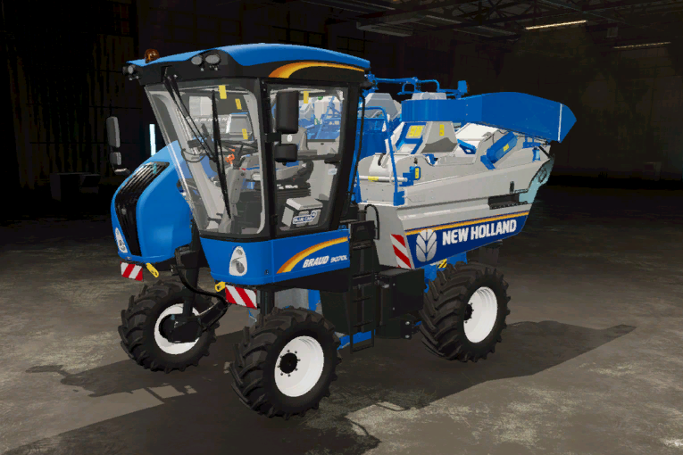

# Bağ çalışması

  
Bağlarda çalışmak, normal bir tarlada çalışmaktan biraz daha karmaşıktır.  
En iyi sonucu almak için, asmalar varsayılan ızgara düzeninde birbirine bitişik olmalıdır.  
Her asmanın başlangıç ve bitişi yaklaşık olarak aynı uzunlukta olmalıdır.  
Asmalar mevcut bir tarla üzerinde bulunuyorsa, rota oluşturucuyu normal şekilde doğrudan açabilirsiniz.  
Asmalar bir tarla üzerinde değilse, YZ Menüsü'nden asmaların üzerine bir tarla işareti yerleştirmeniz gerekir.  

  
Bağlar için kullanılan rota oluşturucuda daha az seçenek bulunmaktadır.  
Kullandığınız araca bağlı olarak asma üzerinde veya asmaların yan tarafında çalışma seçimi yapmanız gerekir.  
Örneğin, standart hasat makinesi asma üzerinde sürerek çalışmalıdır.  
     Ön budama aracı asmanın solundan sürerken asma üzerinde çalışır, bu yüzden asma üzerinde çalışmayı seçmeli ancak bir ofset ayarı yapmalısınız.  
     Püskürtücüler asmaların yan tarafında sürmelidir ve püskürtme işlemi hem sola hem de sağa yapıldığından bir satır atlamaları gerekir.  

  
Hasat makinesi için bağ rotası, asma üzerinde çalışılması gerektiğinden asmanın üzerine denk gelecek şekilde oluşturulmalıdır.  

  
Ön budayıcı asma üzerinde çalışır, bu nedenle rotayı asma üzerinde oluşturmak gerekir.  
Alet traktörün yan tarafında çalışır, böylece traktör asmaların arasından geçer..  

  
Püskürtücü asmaların yanında çalışır, bu nedenle asmaların ya solundan ya da sağından gitmesi gerekir.  
Püskürtücü sol ve sağ asmalara aynı anda işlem yapabildiğinden, bir sıra atlanabilir.  

