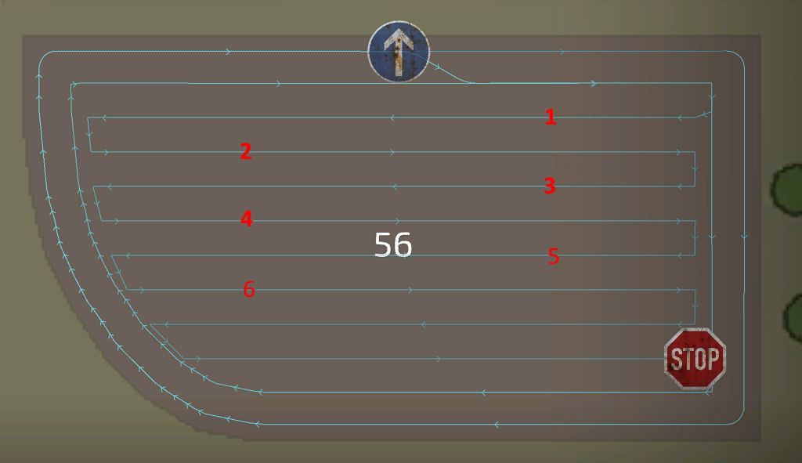

# Генератор курсів: метод руху

  
  
Генератор пропонує кілька різних шаблонів для створення курсу для центру поля. Найкращий шаблон  
  
зазвичай визначається завданням і вибраними знаряддями. Шаблони були створені на основі відгуків та інформації від  
  
нашої спільноти.  
  
Простий шаблон вгору-вниз працює майже завжди для будь-якого знаряддя. Інші шаблони можуть підвищити ефективність, наприклад, використання шаблону  
  
Шаблон загінками найкращий спосіб утримати трубу за межами неприбраних культур для ефективнішого розвантаження.    
  
Для подрібнювачів кращим вибором може бути режим навколо для більш широких поворотів, щоб полегшити роботу розвантажувача.  
  
Спіраль - найкращий варіант для причіпних комбайнів зі зміщенням, щоб інструмент знаходився в плодах, а трактор - зовні.  
  

  
  
    
- Центр поля: Існують різні режими того, як має виглядати ваш шаблон центру поля. Класичний і найпоширеніший човниковий - вгору або вниз.  
  
Режим Спіраль, Навколо і Загінками мають свої переваги над іншими режимами. Наприклад, в режимі 'Загінками' труба комбайна більшу частину часу буде не над незібраними культурами, що полегшує їх вивантаження.  
  
    
- Напрямок по центру: Для схем спіралі і поля ви можете встановити тут напрямок, подібний до напрямку розвороту на краю поля.  
  
    
- Рівномірна ширина ряду: Якщо центр поля має загальну ширину, яка не може бути рівномірно розподілена по робочій ширині інструменту, перший або останній прохід буде вужчим. Ви можете використовувати цей параметр, щоб запобігти цьому і зробити кожен рядок однакової ширини (яка буде меншою за робочу ширину).  
  
    
- Напрямок рядка:  Автоматичний режим здебільшого знаходить найкращий напрямок, але іноді довгий край краще підходить. Якщо вас не влаштовує жоден з варіантів, виберіть ручний і встановіть напрямок вручну.  
  
    
- Кут між рядами: Якщо напрямок рядка встановлено на ручний, цей параметр відображається і вказує генератору напрямок рядків.  
  
  
  
Ці налаштування Відображається лише для певних налаштувань, які ви виконували раніше:  
  
    
- Пропустити рядки: Відображається, коли центр поля встановлено в положення на "вгору або вниз". Це дуже корисна опція для прискорення роботи, оскільки транспортні засоби можуть робити ширші повороти і їм не доведеться розвертатися заднім ходом при повороті в наступний ряд.  
  
    
- Ряди на ділянці: Відображається, коли центр поля встановлений на "загінками". Це впливає тільки тоді, коли центр поля встановлений на загінками, і вказує генератору, скільки рядів повинна мати кожна загінка. Чим більше рядків, тим менше земель буде згенеровано.  
  
    
- Спіраль зсередини: Відображається, коли центр поля встановлено на "спіраль".  
  
    
- Кількість кіл: Відображається, коли центр поля встановлений на "навколо".  
  

## 
вгору або вниз

## 
загонками

## 
спіраль

## 
навколо

