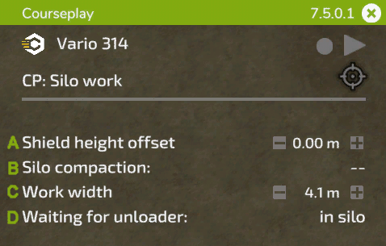

# Mini HUD

## Загальне

  
A: Утримуйте ліву кнопку миші на заголовку, щоб перетягнути HUD у потрібне вам місце. Справа відображається встановлена версія, клацання миші на Х закриває HUD.  
B: Натисніть на значок CoursePlay, щоб отримати доступ до глобальних налаштувань.  
C: Тут відображається назва вашої техніки. Натиснувши на неї, ви потрапите в меню налаштувань техніки.  
D: Ці символи: (1) видалити поточний завантажений курс, (2a) перемикання відображення курсу, (2b) якщо курс не завантажений, то відображається кнопка для початку запису межі поля, (3) запуск або зупинка помічника.  
E: Цей значок цільового об’єкта має різні функції залежно від вибраного режиму: відкриває меню ШІ з завданням і можете розмістити маркер і додаткові налаштування для завдання. На лівій стороні іконки, при роботі на полі, показано залишковий час роботи.  
F: Натисніть на текст, щоб змінити доступні режими для поточних інструментів.  
G: Параметри, показані в цій стрічці, залежать від поточного завдання. Вони будуть пояснені на наступних зображеннях.  

## Роботи у полі

  
A: Клацніть, щоб вибрати, де почати роботу. Якщо завантажено курс для сумісної роботи декількох однакових обладнань, справа ви зможете вибрати смугу.  
B: Відображається назва завантаженого курсу. Якщо ви тільки що згенерували курс, буде написано 'тимчасовий курс'. Як тільки завдання буде запущене, справа ви побачите поточні/загальні точки маршруту.  
C: Клацання по тексту перерахує робочу ширину, або ви можете встановити її вручну справа, натискаючи +/-, або колесом миші над числом.  
D: Для деяких інструментів необхідне поперечне зміщення. CoursePlay обчислить його автоматично при натисканні на текст, або ви можете змінити його вручну так само, як і робочу ширину.  
E: Використовуйте символ справа, щоб скопіювати поточний курс в буфер обміну. Назва скопійованого курсу відображається зліва. Ви можете завантажити скопійований курс на інший транспортний засіб, який ще не має курсу. Щоб видалити курс з буфера обміну, натисніть на символ видалення.  

## Розвантаження комбайну

  
A: Виберіть, який тип транспортного засобу має розвантажувати працівник. Це корисно, коли у вас на полі працюють різні типи техніки, такі як комбайни і навантажувачі (як ROPA Maus).  
B: Встановіть рівень заповнення (40% - 100%), при якому працівник має вирушити на місце розвантаження. Натискайте +/- або використовуйте колесо прокрутки над числом, щоб змінити його.  
C: Іноді положення розвантажувача під трубою не є ідеальним. Це може бути пов’язано з причепом або трубою комбайна, а іноді викликано нахилом поля. Тут ви можете вручну скоригувати бокову відстань до комбайна.  
D: Те ж саме, що і вище, але тут можна налаштувати поздовжнє положення розвантажувача відносно труби.  
E: Подібно до копіювання курсу, тут ви можете скопіювати позиції маркера на іншу техніку.  

## Збирання/обгортання тюків

  
A: Кількість тюків на полі, що залишилась.  
B: Тип тюків для збирання/обгортання.  
C: Зміщення між осьовою лінією трактора та осьовою лінією важеля навантажувача. Можливо, вам доведеться регулювати це для великих тракторів (наприклад, з більш широкими шинами).  

## Навантажувач у силосній ямі

  
A: Залишок розміру насипу в літрах.  
B: Робоча ширина, як і при роботах у полі.  
C: Для CoursePlay потрібна точна висота ковша над землею. Оскільки ця висота може бути різною для кожного інструменту, ви можете перевірити та змінити її в цих налаштуваннях.  
D: Так само, як і з розвантажувачем, ви можете скопіювати позиції маркера на інший навантажувач.  

## Працівник у силосній ямі

  
A: Як і у випадку з навантажувачем у силосній ямі, висота відвала є критичною. Тут ви її можете налаштувати.  
B: Показує хід ущільнення. Клік по ньому перемикає опцію зупинки водія при досягненні повного ущільнення.  
C: Ви можете змінити робочу ширину за необхідності.  
D: Цей параметр вказує працівнику де чекати коли розвантажувач наближається до ями: в ямі або на вибраній парковці.  

