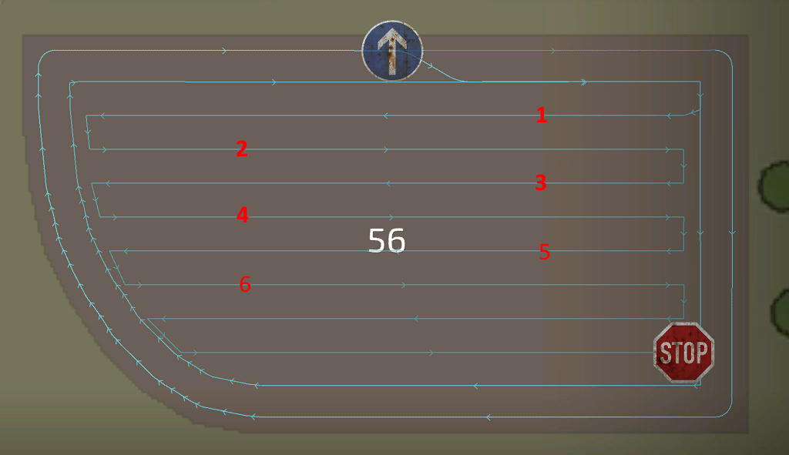

# Course generator: center

  
The generator provides several different patterns to generate the course for the center of the field. The best pattern is  
usually determined by the job and the implements selected. The patterns were created based on feedback and information from  
our community.  
The simple up down pattern works almost every time for any tool. Other patterns may improve efficiency, such as using the  
Lands pattern when harvesting with a combine will keep the pipe out of the fruit for a more faster unloading.  
For choppers, racetrack can be a better choice for wider turns to make the work of the unloader easier.  
Spiral is a best for towed harvesters with an offset to keep the tool in the fruit and the tractor outside.  

  
- Field center: There are different modes on how your field center pattern should look like. The classic and most used one is up/down.  
Spiral, Racetrack and Lands have their own specific advantages over the others. Lands for example will have the combine's pipe point out of the fruit most of the time to easier unload them.  
- Center direction: For the spiral and lands patterns you can set here the direction, similar to the headland direction.  
- Even row width: If the center of a field have a total width that can't evenly be split over the work width of the tool, the first or last row will be narrower. You can use this setting to prevent this and make each row the same width (which will be less than the working width).  
- Row direction: automatic mostly finds the best direction, but sometimes the longest edge fits better. If you are not happy with either one, choose manual and set the direction manually.  
- Row angle: When the row direction is set to manual, this setting appears and will tell the generator the direction of the rows.  
  
These settings appear only for specific settings you have done before:  
- Rows to skip: Appears when field center is set to "up/down". This is a very helpful option to accelerate your work, as vehicles can make wider turns and won't have to reverse when turning into the next row.  
- Rows per Land: Appears when field center is set to "lands". This has only impact when the field center is set to lands and will tell the generator how many rows each land should have. The more rows, the fewer lands will be generated.  
- Spiral from inside: Appears when field center is set to "spiral".  
- Number of circles: Appears when field center is set to "racetrack".  

## 
up/down

## 
lands

## 
spiral

## 
racetrack

