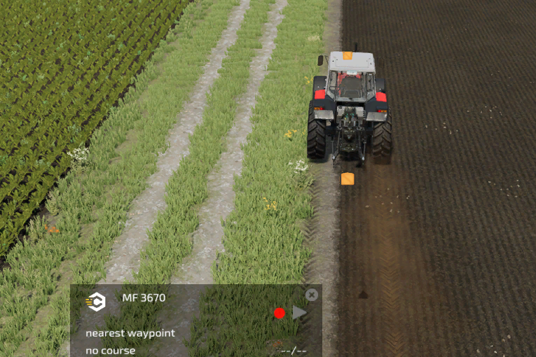
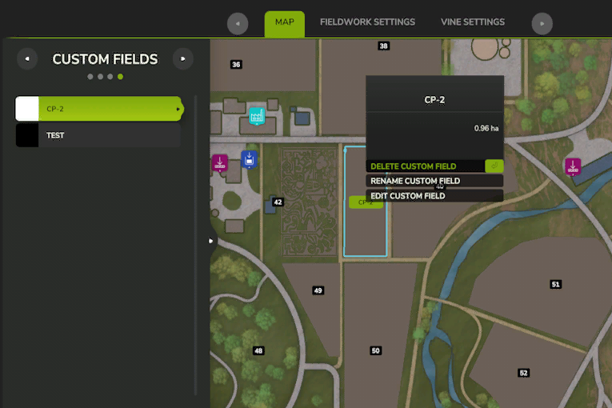

# 自訂田地

  
有兩種方法可以建立自訂田地。  
第一個是使用HUD的紀錄功能。  
開始記錄並記錄田地邊界。  
完成後，再次按下按鈕，系統會詢問您是否要儲存它。  

查看 AI 菜單，您將看到記錄的田地邊界。  
通過單擊名稱，您將獲得刪除或重命名的選項。   

The second option is to draw the custom field on the map of the CP AI menu.  
To start the drawing, hit they button on the bottom left corner or hit corresponding key.  
After that a text appears on the top of your screen.  
Start by clicking the right mouse button for setting the start position.  
By holding the shift key, the line will be set straight in 90° angles.  
The next clicks will create lines to the previous click.  
Once you draw a second line, the course will be automatically closed. You can still draw more lines to define the field even further.  
You don't need to draw the last line to the start, as it gets generated automatically straight to the start.  

