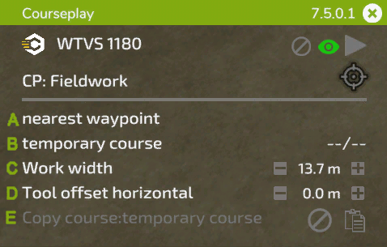

# 迷你HUD

## 完整的HUD

  
A: 按住标题上的鼠标左键，将HUD拖动到您喜欢的位置。在右侧，显示已安装的版本，X将通过鼠标单击关闭HUD.  
B： 单击Courseplay图标以访问全局设置。  
C： 在此位置显示您的车辆名称。点击它将进入车辆设置菜单。  
D： 这些符号用于：（1）删除当前加载的课程，（2a）切换课程将如何显示，（2b）如果没有加载课程，则显示记录按钮以记录字段边界课程，（3）启动或停止助手。  
E： 此目标图标根据所选模式有不同的选项，它会打开作业的AI菜单，并能够为作业放置标记和其他设置。在图标的左侧，随着实地考察的进行，将显示课程的剩余时间。  
F： 单击文本以切换当前工具的可用模式。  
G： 此行下显示的设置取决于当前作业。以下图片将对此进行解释。  

## 田间工作

  
A： 单击以选择开始工作的位置。如果加载了多工具课程，则可以在右侧选择车道。  
B： 显示加载的课程的名称。如果您刚刚生成了一个课程，它将显示“临时课程”。在右侧，您将看到作业启动后的当前/总航路点。  
C： 单击文本将重新计算工作宽度，或者您可以通过单击+/-在右侧手动设置，或者将鼠标滚轮放在数字上。  
D： 有些工具需要向侧面偏移。Courseplay会在点击文本时自动计算它，或者你可以像工作宽度一样手动更改它。  
E： 使用右侧的符号将当前课程复制到剪贴板。复制的课程名称将显示在左侧。您可以将复制的路线加载到另一辆还没有路线的车辆中。要从剪贴板中删除课程，请单击删除符号。  

## 联合收割卸载工作

  
A： 选择工人应卸载的车辆类型。如果您有不同的类型，如联合收割机和装载机，如在同一场地上工作的ROPA-Maus，这将非常有用。  
B： 设置工人应开车到卸货地点的填充水平（40%-100%）。单击+/-或在数字上使用滚轮进行更改。  
C： 有时，卸料机在管道下方的位置并不完美。这可能是由于拖车或收割机的管道造成的，有时是由于田地的坡度造成的。您可以在此处手动校正到收割机的距离。  
D： 与上面相同，但在这里可以将卸粮器相对于管道的位置调整到前面或后面。  
E： 与复制路线类似，您可以在此处将标记位置复制到另一辆车上。  

## 草捆的收集/打包

  
A： 田地上的剩余捆数。  
B： 要收集/包裹的捆的类型。  
C： 拖拉机中心线和装载机臂中心线之间的偏移。对于较大的拖拉机（例如，轮胎较宽的拖拉机），您可能需要对此进行调整。  

## 青贮池装填

  
A： 堆的剩余大小（以升为单位）。  
B： 工作宽度，与实地工作相同。  
C： 课程播放需要正确设置铲斗离地的确切高度。由于每个工具的高度可能不同，因此可以使用此设置进行检查和调整。  
D： 就像卸载机一样，您可以将标记位置复制到另一辆车上。  

## 青贮池工作

  
A： 与筒仓装载机类似，整平机的高度至关重要。你可以在这里调整。  
B： 显示压实的进度。单击它，切换选项以在达到完全压实时停止驱动程序。  
C： 您可以根据需要在此处更改工作宽度。  
D： 此设置告诉当卸载机接近筒仓时，工人在筒仓或选定的停车位置等待。  

