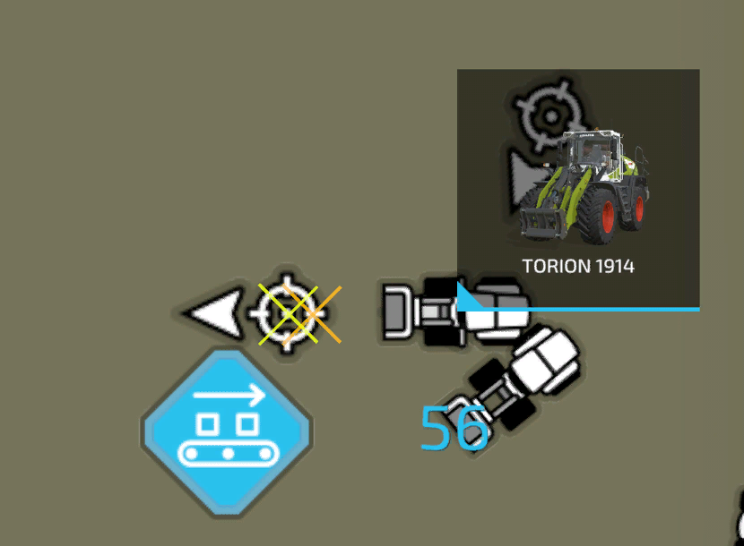

# 轮式装载机、铲车驾驶

  
此模式启用轮式装载机和带前装载机的拖拉机。  
通过连接铲子，可以从地面拾取堆料，也可以从料仓中装载。  
拾取的液位可以自动卸载到附近的拖车或选定的卸载站，如BGA。  
电铲将自动移动到正确的位置进行装载、卸载等操作。  
在hud上不能直接看到模式的情况下，您可以切换“”；起始位置”；直到出现铲模式。  
hud上的目标图标可用于打开AI地图，以选择装载和卸载目标。  
hud还显示助手工作时堆或思洛存储器的剩余填充水平。  
如果装载目标是料仓筒仓，则可能需要调整工作宽度，以避免撞击筒仓的侧壁。  
高度偏移设置用于调整地面以上的高度，因为并非所有电铲都能正确计算。  
如果铲斗处于装载低位，驾驶员无法再转动，或者铲斗处于高位，且地面未达到填充水平，则应对此进行检查。  
如果该值发生变化，电铲将自动移动到装载位置，以显示偏移的影响。  
要重置偏移量，您需要单击hud中的设置文本。该值可以在0.1 setps内从+1调整到-1。  
带有青贮抓斗的铲子将自动打开和关闭，以便装载和卸载。  
用来切甜菜丝的铲子也功能齐全。  

  
要启动轮式装载机辅助程序，您需要通过单击hud上的目标图标来设置装载和卸载位置。  
装载位置的工作方式与装载机模式下的相同。堆周围将创建一个蓝色正方形。  
卸载位置取决于您是要卸载到拖车还是卸载到卸载站。  
如果选择卸载到拖车中，则需要在AI菜单上选择拖车将停放的区域。  
该助手将开车前往该区域内任何停放的拖车。标记的方向没有实际意义。  
如果要卸载到卸载站，则需要切换目标，然后在触发器上标记卸载位置。  

  
选择触发器一开始看起来确实有点复杂，但实际上很容易。  
每栋建筑都可以有多个触发器，所以你必须选择要卸载到的触发器。  
所有可用的触发器将在AI地图上显示为橙色十字。  
要选择一个位置，请将圆形标记的中间放置在十字架的中间。  
箭头的干燥告诉助手他将从哪个方向接近扳机进行卸载。  
现在，您的选择应该与图像相似。  

